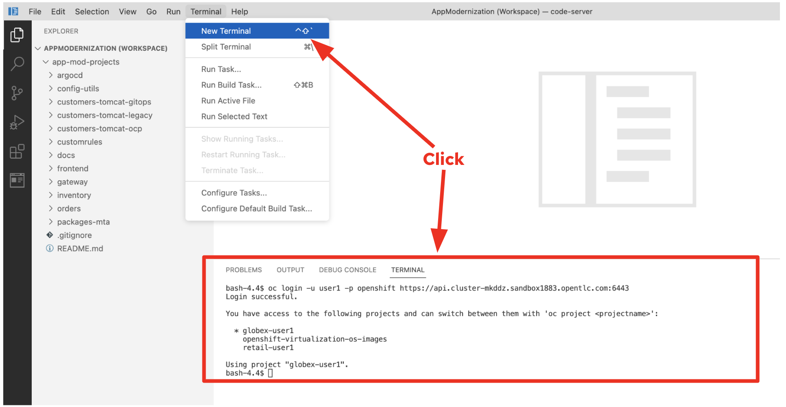

= 1. Introduction - 10 minutes

Application modernization strategies are often categorized into the `6R`’s framework that was popularized by Amazon (and prior the 5Rs by Gartner). Here is what they mean.

image::../images/mod-strategies.png[Modernization Strategies]

Red Hat helps our customers' application modernization journey with this approach:

image::../images/app-mod-approach.png[Modernization Approach]

This workshop will walk you through 2 of the phases (_Assess_, _Rationalize_) as following steps:

* Assessment of the legacy application using https://www.konveyor.io/tools/tackle/[Konveyor Tackle^] 
* Analysis of the legacy application archive and refactor the application using https://access.redhat.com/documentation/en-us/migration_toolkit_for_applications/5.3[Migration Toolkit for Applications^]
* Migration of a database to OpenShift virtualization using https://access.redhat.com/documentation/en-us/migration_toolkit_for_virtualization/2.3[Migration Toolkit for Virtualization^]
* Deploy the modernized applications to Kubernetes/OpenShift using https://access.redhat.com/documentation/en-us/openshift_container_platform/4.10/html-single/cicd/index#gitops[OpenShift GitOps (ArgCD)^]

== 1.1. Understand the Globex Retail System Architecture

The Globex system (workshop environment) has the whole microservices applications that are deployed multiple platforms such as virtual machines and container platform as below.

image::../images/architecture_initial.png[architecture_initial]

Your initial state for this workshop is an environment that is spread over Red Hat Virtualization and Red Hat OpenShift Container Platform.

Your application has been partially already moved from your legacy environments to OpenShift.

The Globex retail system is multiple services consisting of a Node.js frontend service which is getting its data via a gateway service. The gateway service is connected to three backend services: customers, orders and inventory. Each of the backend services uses its own database to store data.

The services running on OpenShift are deployed in a namespace `retail`. The services are also managed using a GitOps approach by *ArgoCD*.

[NOTE]
====
You might see the customers pods are failed to run due to _ImagePullBackOff Error_. It will be fixed when you finish the *Deploy to Kubernetes* section.
====

All source code for the applications as well as the GitOps YAML manifests for all services are stored in a (GitHub compatible) Gitea repository that for workshop purposes is hosted on the OpenShift cluster.

The problem right now is the customers service:

* The customers service uses an old Java code base running on Apache Tomcat in a VM on Red Hat Virtualization. In the course of this demonstration you will modernize the Java Code and then deploy the application to OpenShift on top of Red Hat JBoss Web Server.
* The customers database is using an _Oracle_ database running as a VM in Red Hat Virtualization. Because this is Oracle you can not deploy the database as a Pod on OpenShift - therefore you will migrate the VM to OpenShift Virtualization using the OpenShift Migration Toolkit for Virtualization.

When you have finished this demonstration your deployment architecture should look like this:

image::../images/architecture_completed.png[architecture_completed]

== 1.2. Workshop Environment

=== 1.2.1. Claim the Shared Workshop Cluster

Open a new web browser to access the https://demo.redhat.com/workshop/jj6sec[RHPDS page^].

* Email: `Your Email Address` (e.g. _doh@redhat.com_)
* Access Password: `frankfurt`

image::../images/user-login.png[user-login]

Once you logged in successfully, the detail information of the shared cluster environment shows as below.

image::../images/shared-cluster-details.png[shared-cluster-details]

[IMPORTANT]
====
You have to use *an unique username* (e.g. `user1`) while you're running the hands-on labs. For example, you need to deploy applications to your own project (e.g. *retail-user1*). Keep in mind that you should replace `userXX` with your own username in the next labs.
====

=== 1.2.2. OpenShift Cluster

Your OpenShift cluster is already configured with everything you need. Here are the details:

* Latest stable OpenShift Container Platform is deployed as a bare metal single node OpenShift environment.
* The following operators have been installed and configured:
** `Gitea` to host the source code repositories)
** `OpenShift Virtualization` to ultimately run the migrated Oracle VM)
** `Migration Toolkit for Virtualization` to facilitate the migration of the Oracle VM from Red Hat Virtualization to Red Hat OpenShift Container Platform)
** `OpenShift GitOps` to manage the deployed services using a GitOps approach through ArgoCD
** `OpenShift Pipelines` to build the customer application from source code and deploy to the `retail` project using GitOps
** `Migration Toolkit for Applications` (Tackle) to help modernize the customer service Java source code.

=== 1.2.3. Visual Studio Code Server

Visual Studio (VS) Code Servers are already deployed in the OpenShift cluster to facilitate an easy demonstration environment. This means you don't need to install and configure VS Code on your local environment but you can just use the one provided in a web browser.

This makes it easy to change any source code and configuration files in the cloned repository. The URL and password for the VS Code Server can be found in the *shared environment detail page*.

Open a new browser to access the VS Code server using the following credential.

* Password: `openshift`

image::../images/vscode-server-login.png[vscode-server-login]

The graphical user interface (GUI) should look like:

image::../images/vscode.png[VSCode]

== 1.3. Explore the Globex Retail Services (GUI)

You can check what the `Globex retail service` looks like currently by accessing the frontend web application. To find the URL to access the *Frontend* application, you need to use the OpenShift command line tool (`oc`). Go to the VS Code server and Open a new terminal that already installed the _oc_ command by default. 

Click on `New Terminal` in _Terminal_ menu in the VS Code. Once a new terminal is open, run the following _oc_ command.

[NOTE]
====
Replace `YOUR_Openshift_API_URL` and `userXX` with your own information in the *shared environment detail page*.
====

[source,sh]
----
oc login -u userXX -p openshift https://YOUR_Openshift_API_URL 
----

Find the `Route` URL for the *Frontend* application. Run the following `oc` command in the VS Code server terminal.

[source,sh]
----
oc get route ordersfrontend -n retail-userXX
----

The output should look like:

[source,texinfo]
----
NAME             HOST/PORT                                                                PATH   SERVICES         PORT   TERMINATION     WILDCARD
ordersfrontend   ordersfrontend-retail-user1.apps.cluster-mkddz.sandbox1883.opentlc.com          ordersfrontend   web    edge/Redirect   None
----

Navigate to the orders frontend route. You can use either _https_ or _http_ (which will be redirected to _https_).

image::../images/frontend.png[Frontend]

Click through the three panels on the left.

* `Customers` shows the list of the customer information such as _fullname, city, country, and username_.
* `Orders` shows current order information including relevant customer data.
* `Products` shows the current inventory information.

== 1.4. Access the Customer Data

// === 1.4.1 Connect using DBeaver

// You can use https://dbeaver.io[DBeaver (Community Edition)^] to connect to the Oracle database on Red Hat Virtualization (RHV).

// . Download ans install the version of DBeaver suitable for your environment.
// . Launch *DBeaver*
// . Right click the *Database Navigator* Panel and select *Create* -> *Connection*
// . Select *Oracle* and click *Next*
// . Fill in the properties (use the values in the *shared environment detail page*), leave default values where not specified otherwise
// .. *Host*: `YOUR OWN Oracle Database VM IP Address`
// .. *Database*: `XEPDB1`
// .. *Username*: `customer`
// .. *Password*: `redhat`
// . Click *Test Connection ...*. You should see a success message.
// . Click *Finish*

// Next you can show the contents of the database:

// . Expand *XEPDB1* then expand *Schemas*
// . Expand *CUSTOMER* then expand *Tables*
// . Double click on *CUSTOMERS* under *Tables*
// . On the right you can show the table properties (first tab) and table properties (*Data* tab)

// image::../images/customer-dbms.png[Connect using DBeaver]

// === 1.4.2. Demonstrate the Customer Application deployed on Tomcat

The RHV environment not only has the Oracle Database VM deployed but it also hosts another VM which runs the old customer application on top of Apache Tomcat.

From a terminal window you can use `curl` to demonstrate that the application is connected to the database.

Use the IP Address of the *Customer Service (Tomcat VM)* to access the customer service. You can run the following _curl_ command in the VS Code server's terminal or your local environment since the Tomcat IP address is publicly accessible. 

Run the following `oc` commands in the VS Code server terminal.

[source,sh]
----
curl http://YOUR_Tomcat_VM_IP_ADDR:8080/customers-tomcat-0.0.1-SNAPSHOT/customers/1 ; echo
----

The output should look like:

[source,texinfo]
----
{"id":1,"username":"phlegm_master_19","name":"Guybrush","surname":"Threepwood","address":"1060 West Addison","zipCode":"ME-001","city":"Melee Town","country":"Melee Island"}
----

Try to get another customer data.

[source,sh]
----
curl http://YOUR_Tomcat_VM_IP_ADDR:8080/customers-tomcat-0.0.1-SNAPSHOT/customers/2 ; echo
----

The output should look like:

[source,texinfo]
----
{"id":2,"username":"hate_guybrush","name":"Pirate","surname":"Lechuck","address":"Caverns of Meat, no number","zipCode":"MO-666","city":"Giant Monkey Head","country":"Monkey Island"}
----

➡️ link:./2-assessment.adoc[2. Assessment]