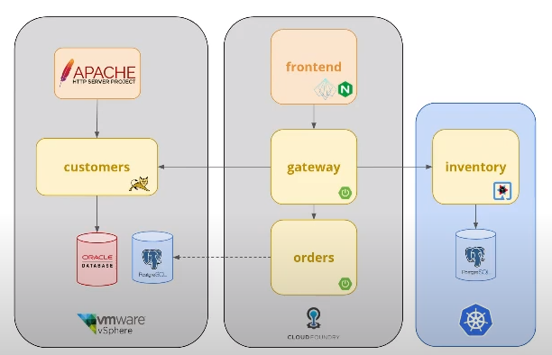

== Introduction

We created Konveyor to help you more easily modernize your applications
to Kubernetes. IN this workshop we’ll guide you through an entire app
modernization scenario using tools provider by the Konveyor project.

=== About Konveyor

Konveyor is a community of people passionate about helping others
modernize and migrate their applications to the hybrid cloud by
providing tools to accelerate rehosting, replatforming, and refactoring
their applications to run on Kubernetes.

=== Workshop scenario

The scenario demonstrated in this workshop is typical of the type of
environments we would expect to see from organizations suffering from
poor software performance delivery. There are many reasons for the poor
performance including the application architecture itself, the software
development process, the lack of automation, and other factors.

In this example the architecture is derived from a monolith application
which has been converted to microservices using the strangler pattern
(LINK). As you can see from the image below, there are multiple
technologies and platforms involved.

* Apache tomcat application with Oracle database running in a VM on
vmware
* Node.js and SpringBoot applications deployed on Cloud Foundary
* Quarkus application and PostgreSQL database running on Kubernetes

=== Worksop goals

The primary goal of the workshop is to guide the user through the
migration of these services to a properly configured Kubernetes
environment so that they can take advantage of the automated/container
based deployments and the all new cloud-native technologies.

=== Konveyor tools

We can use the tools within the Konveyor community to move our
applications. We will use Tackle to assess and analyze the tomcat
application, rehost the database into KubeVirt, migrate Spring Boot to
Kubernetes, and refactor the Angular app to leverage the GitOps model
properly on Kubernetes.

Next link:./2-assessment.adoc[Assessment]
