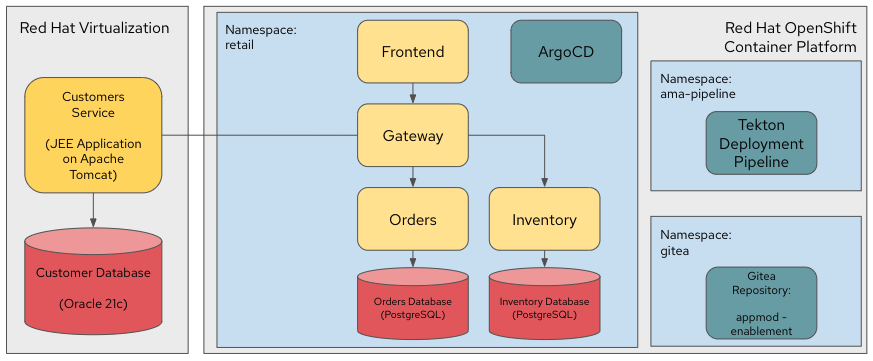
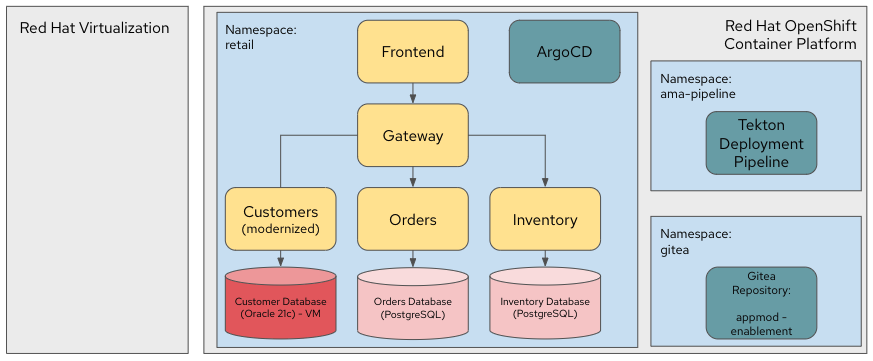
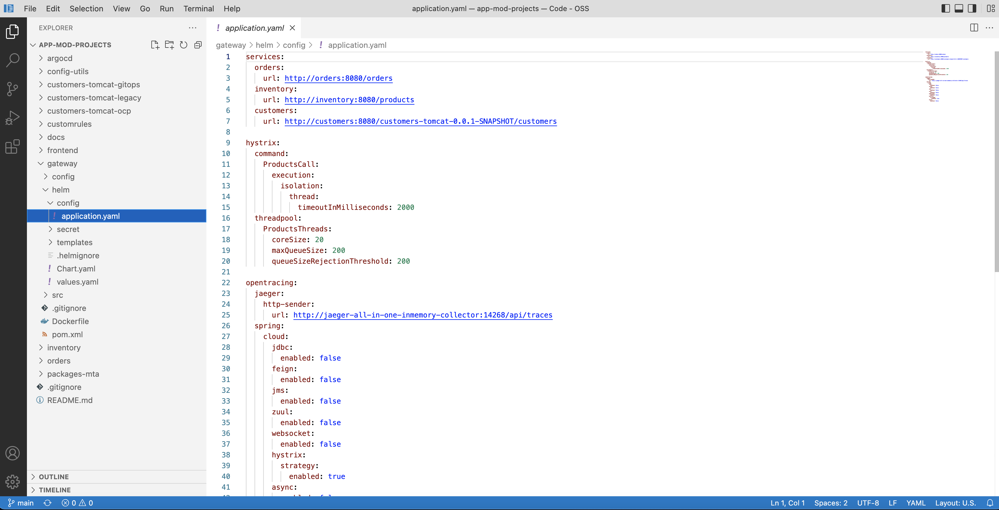

= Introduction

Application modernization strategies are often categorized into the `6R`’s framework that was popularized by Amazon (and prior the 5Rs by Gartner). Here is what they mean.

image::../images/mod-strategies.png[Modernization Strategies]

Red Hat helps our customers' application modernization journey with this approach:

image::../images/app-mod-approach.png[Modernization Approach]

This demo will walk you thorough 2 phases (_Assess_, _Rationalize_) as following steps:

   1. Assessment of the legacy application using https://www.konveyor.io/tools/tackle/[Konveyor Tackle^] 
   2. Analysis of the legacy application archive and refactor the application using https://access.redhat.com/documentation/en-us/migration_toolkit_for_applications/5.3[Migration Toolkit for Applications^]
   3. Deploy the modernized applications to Kubernetes/OpenShift using https://access.redhat.com/documentation/en-us/openshift_container_platform/4.10/html-single/cicd/index#gitops[OpenShift GitOps (ArgCD)^]
   4. Migration of a database to OpenShift virtualization using https://access.redhat.com/documentation/en-us/migration_toolkit_for_virtualization/2.3[Migration Toolkit for Virtualization^]

== Explore the environment

Your initial demo environment has the whole microservices applications deployed and working.

Your initial state for this demo is an environment that is spread over Red Hat Virtualization and Red Hat OpenShift Container Platform.

Your application has been partially already moved from your legacy environments to OpenShift.

The application is a multi service application consisting of a Node.js frontend service which is getting its data via a gateway service. The gateway service is connected to three backend services: customers, orders and inventory. Each of the backend services uses its own database to store data.

The services running on OpenShift are deployed in a namespace `retail`. The services are also managed using a GitOps approach by *ArgoCD*.

You might see the customers poda are failing since there's a bug we will figure out...

All source code for the applications as well as the GitOps YAML manifests for all services are stored in a (GitHub compatible) Gitea repository that for demo purposes is hosted on the OpenShift cluster.

The problem right now is the customers service:

* The customers service uses an old Java code base running on Apache Tomcat in a VM on Red Hat Virtualization. In the course of this demonstration you will modernize the Java Code and then deploy the application to OpenShift on top of Red Hat JBoss Web Server.
* The customers database is using an Oracle 21c database running as a VM in Red Hat Virtualization. Because this is Oracle you can not deploy the database as a Pod on OpenShift - therefore you will migrate the VM to OpenShift Virtualization using the OpenShift Migration Toolkit for Virtualization.

When you have finished this demonstration your deployment architecture should look like this:

== OpenShift Configuration

=== OpenShift Cluster

Your OpenShift cluster is already configured with everything you need. Here are the details:

* Latest stable OpenShift Container Platform 4.10 is deployed as a bare metal single node OpenShift environment.
* The following operators have been installed and configured:
** Gitea (to host the source code repositories)
** OpenShift Virtualization (to ultimately run the migrated Oracle VM)
** Migration Toolkit for Virtualization (to facilitate the migration of the Oracle VM from Red Hat Virtualization to Red Hat OpenShift Container Platform)
** OpenShift GitOps: to manage the deployed services using a GitOps approach through ArgoCD
** OpenShift Pipelines: to build the customer application from source code and deploy to the `retail` project using GitOps
** Migration Toolkit for Applications (Tackle): to help modernize the customer service Java source code.

Instructions on how to access the OpenShift console, Gitea or Migration Toolkit for Applications along with userids and passwords can be found in the provisioning e-mail.

=== Bastion VM

Your Bastion VM for the cluster has all the necessary tools installed (`oc`, `virtctl`, `tkn`). It also has a copy of the `appmod-enablement` repository in your home directory.

Instructions on how to access the bastion VM can be found in the provisioning e-mail.

=== Visual Studio Code (Server)

To facilitate an easy demonstration environment the bastion has a Visual Studio Code Server installed. This means you don't need to install and configure VSCode on your demo laptop but you can just use the one provided in a web browser.

This makes it easy to change any source code (or configuration files) in the cloned repository.

The URL and password for the VSCode Server can be found in the provisioning e-mail.

[NOTE]
You see the configuration file for the *gateway* service in the screenshot above. You will notice that two services (orders and inventory) point to the services on OpenShift and that the customers service points to the customers VM on RHV.

== Demonstrating the Application

You can show that the application is working in its current deployment.

. Find the `Route` for the *Frontend* application
+
[source,sh]
----
oc get route ordersfrontend -n retail
----
+
.Sample Output
[source,texinfo]
----
NAME             HOST/PORT                                                          PATH   SERVICES         PORT   TERMINATION     WILDCARD
ordersfrontend   ordersfrontend-retail.apps.cluster-amawk.amawk.devel.opentlc.com          ordersfrontend   web    edge/Redirect   None
----

. Navigate to the orders frontend route. You can use either https or http (which will be redirected to https).
+
image::../images/frontend.png[Frontend]

. Click through the three panels on the left.
.. Customer doesn't work (bug in the code)
.. Orders shows current orders. You can tell that customers is working beause the first two columns are populated by the customers service
.. Products shows the current inventory

==  Demonstrating the Oracle Database

=== Connect using DBeaver

You can use https://dbeaver.io[DBeaver (Community Edition)^] to connect to the Oracle database on Red Hat Virtualization (RHV).

. Download ans install the version of DBeaver suitable for your environment.
. Launch *DBeaver*
. Right click the *Database Navigator* Panel and select *Create* -> *Connection*
. Select *Oracle* and click *Next*
. Fill in the properties (use the values from your welcome e-mail), leave default values where not specified otherwise
.. *Host*: `<from the e-mail>`
.. *Database*: `XEPDB1`
.. *Username*: `customer`
.. *Password*: `redhat`
. Click *Test Connection ...*. You should see a success message.
. Click *Finish*

Next you can show the contents of the database:

. Expand *XEPDB1* then expand *Schemas*
. Expand *CUSTOMER* then expand *Tables*
. Double click on *CUSTOMERS* under *Tables*
. On the right you can show the table properties (first tab) and table properties (*Data* tab)

image::../images/customer-dbms.png[Connect using DBeaver]

=== Demo the Customer Application deployed on Tomcat

The RHV environment not only has the Oracle Database VM deployed but it also hosts another VM which runs the old customer application on top of Apache Tomcat.

From a terminal window you can use `curl` to demonstrate that the application is connected to the database.

. Use the IP Address of the *Customer Service (Tomcat VM)* to access the customer service.
+
[source,sh]
----
curl http://YOUR_Tomcat_VM_IP_ADDR:8080/customers-tomcat-0.0.1-SNAPSHOT/customers/1
----
+
.Sample Output
[source,texinfo]
----
{"id":1,"username":"phlegm_master_19","name":"Guybrush","surname":"Threepwood","address":"1060 West Addison","zipCode":"ME-001","city":"Melee Town","country":"Melee Island"}
----

. Try another customer
+
[source,sh]
----
curl http://169.60.225.219:8080/customers-tomcat-0.0.1-SNAPSHOT/customers/2
----
+
.Sample Output
[source,texinfo]
----
{"id":2,"username":"hate_guybrush","name":"Pirate","surname":"Lechuck","address":"Caverns of Meat, no number","zipCode":"MO-666","city":"Giant Monkey Head","country":"Monkey Island"}
----

➡️ Next section: link:./2-assessment.adoc[2 - Assessment]
