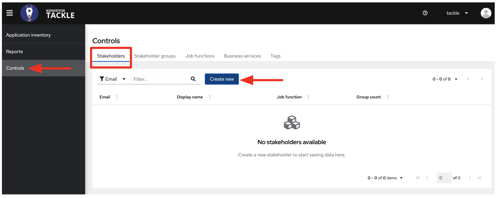
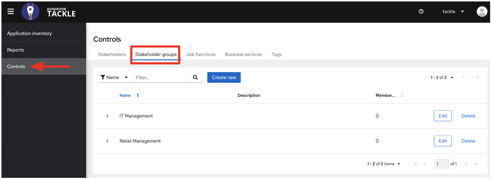
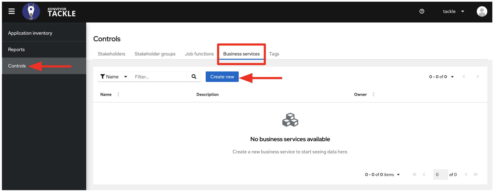
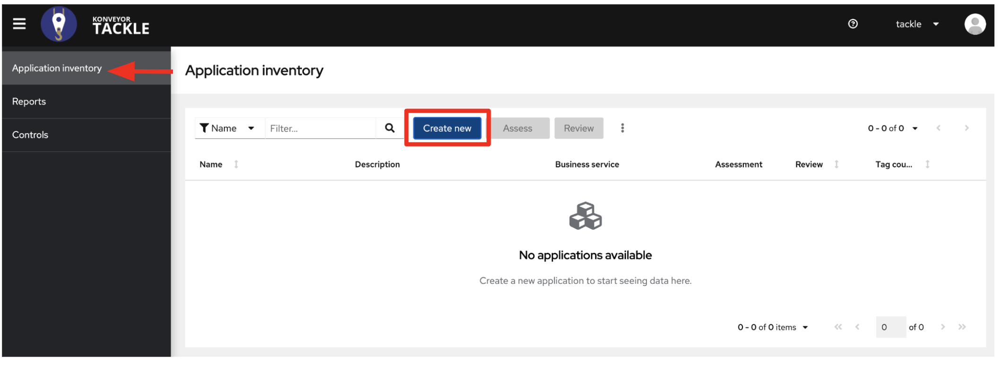
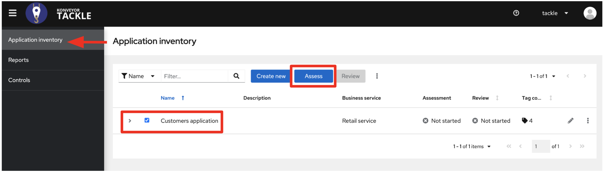
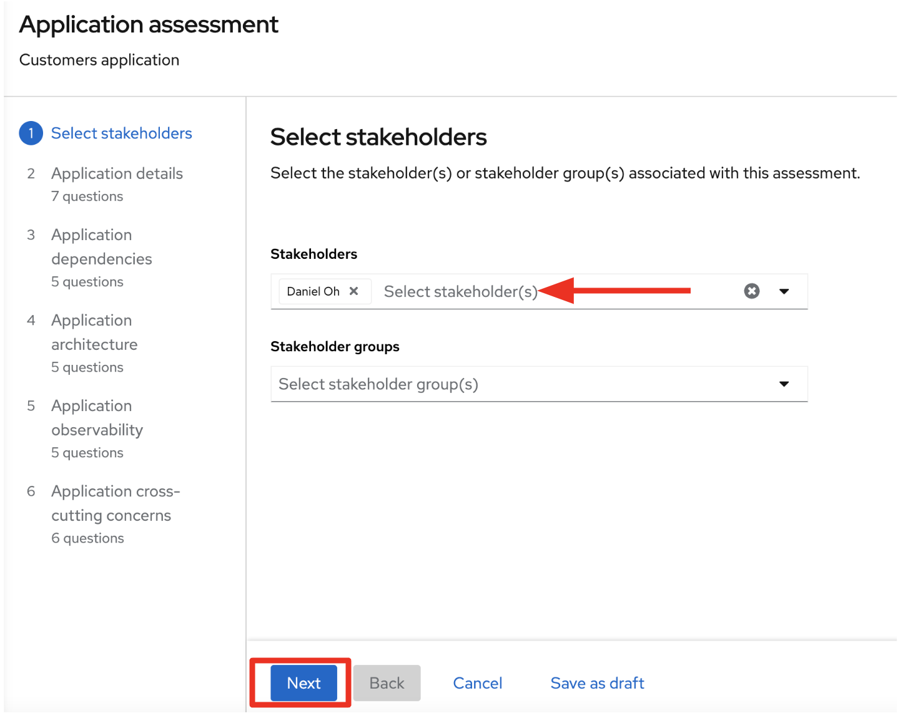
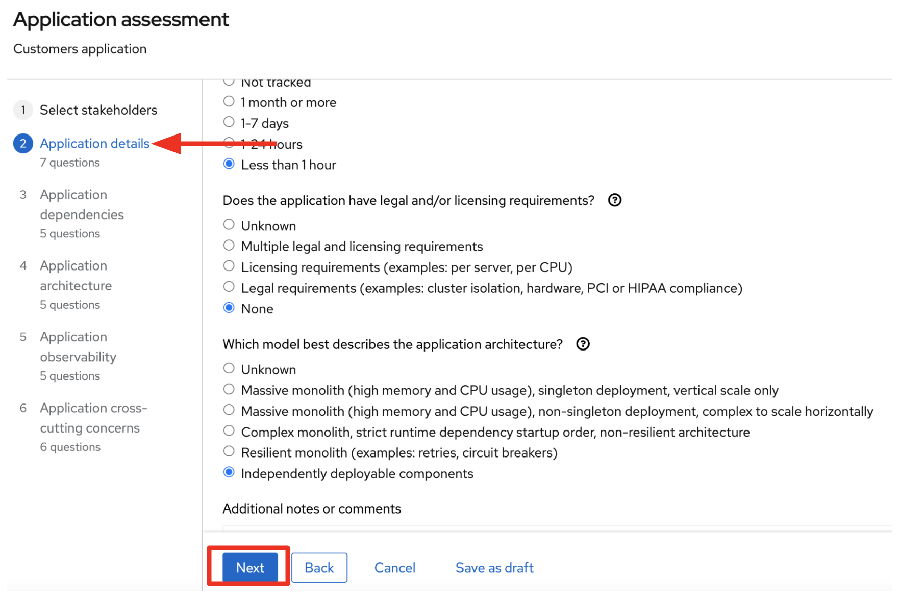
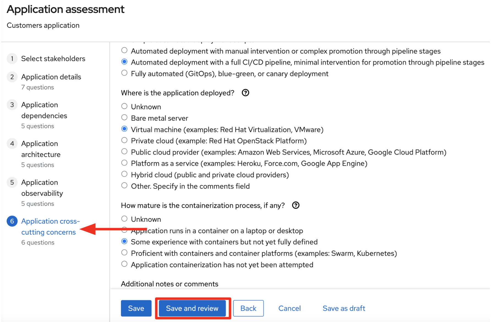
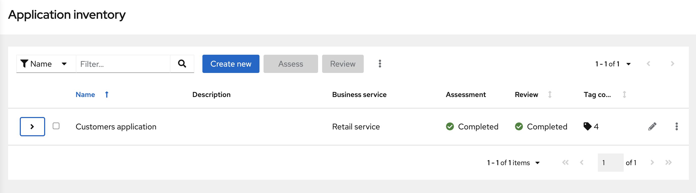
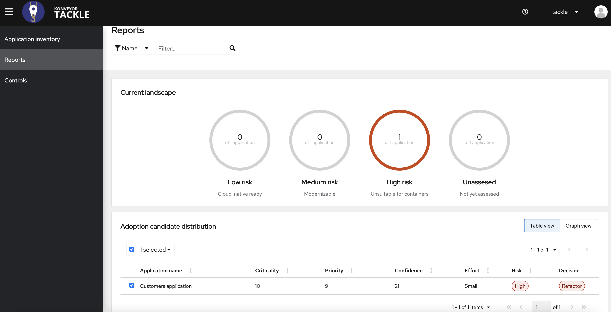

= 2. Assessment - 25 minutes

To start the assessment of the existing applications we will use the https://www.konveyor.io/tools/tackle[Tackle^] Application Assessment tool in the https://www.konveyor.io[Konveyor^] community to move our applications. We will use _Tackle_ to assess the `Customers` service based on the _Tomcat_ server on Red Hat Virtualization.

Open a new browser to access the Tackle web console that is provided from the email. Use the following credential.

* Username or email: `tackle`
* Password: `password`

image::../images/tackle-login.png[Tackle Login]

You will see existing application inventories such as *Customers*, *Orders*, and *RetailFrontend*.

image::../images/application-inventory.png[application inventory]

**Tackle Application Inventory** is the vehicle which selects applications for assessment by https://github.com/konveyor/tackle-pathfinder[Pathfinder^] and analysis by https://github.com/windup/[windup^]. It provides users four main functions:

* Maintain a portfolio of applications.
* Link applications to the business services they support.
* Define interdependencies.
* Add metadata using an extensible tagging model to describe and categorize applications in multiple dimensions.

**Tackle Pathfinder** is an interactive questionnaire based tool that assesses the suitability of applications for modernization in order to deploy them into containers on an enterprise Kubernetes platform. The tool output includes:

* Application’s suitability for Kubernetes
* Associated risks
* Adoption plan with the applications’ prioritization, business criticality and dependencies.

== Controls

https://github.com/konveyor/tackle-controls[Tackle Controls^] are a collection of entities that add value to Application Inventory and the Pathfinder assessment. They comprise _business services_, _stakeholders_, _stakeholder groups_, _job functions_, _tag types_, and _tags_.

=== Stakeholders

Go to `Controls` on the left menu and you will existing _stakeholders_ such as *Hank Scorpio* and *Homer Simpson*.

You can also find the existing _stakeholder groups_ such as *IT Management* and *Retail Management* for the application assessment.

=== Business services

Applications can be classified and grouped in multiple ways such as **business service**. We've created a business service for the legacy `Retail` applications.

Go to `Controls` on the left menu and click on _Business services_ tab. You will see existing _business services_ such as *Finance and HR* and *Retail*.

== Application inventory

Let’s focus on the legacy application. We have added tags that represent its technology, like java, Tomcat and Oracle, and decided to add a custom tag type that allows us to identify which custom architecture libraries are used by each application.

=== Update the Customers Application Inventory

Go to `Application inventory` on the left menu and click on `pencil` icon for the customers inventory.

Fill in the following fields. Then, click on `Save`.

* Business service: `Retail`
* Tags: `Java`, `Tomcat`, `RHEL 8`, `Oracle`

image::../images/update-new-app-inventory.png[update-new-app-inventory]

=== Expand the Legacy Customers Application

Since the legacy application comes from a traditional platform and we are aware about some problems with the configuration model, let’s focus on this one for the assessment.

To start the assessment, select the customers application. Then, click on `Assess`.

[NOTE]
You might see `This application has already been assessed. Do you want to continue?` message, then click on `Continue` to make sure that the following answers are selected for each step.

First step will be to select the stakeholders (_e.g. Homer Simpson_) involved with the assessment. Leave the default values.

Once you’re happy with the stakeholders, click on `Next`.

The assessment is driven by a questionnaire, and aims to determine the suitability for containerization for a given application. It covers all the different areas of the application landscape, including the technology, application lifecycle management, and operations.

These questions allow the tool to identify potential risks that might prevent the application from running in containers or would require any kind of adjustment for that.

==== Application details

Choose the following answers for each question.

* Does the application development team understand and actively develop the application?
** Actively developed, SME knowledge is available

* How is the application supported in production?
** SRE (Site Reliability Engineering) approach with a knowledgeable and experienced operations team

* How much time passes from when code is committed until the application is deployed to production?
** 1-7 days

* How often is the application deployed to production?
** Weekly

* What is the application's mean time to recover (MTTR) from failure in a production environment?
** Less than 1 hour

* Does the application have legal and/or licensing requirements?
** None

* Which model best describes the application architecture?
** Resilient monolith (examples: retries, circuit breakers)

Click on `Next`.

==== Application dependencies

Choose the following answers for each question.

* Does the application require specific hardware?
** Requires CPU that is supported by Red Hat

* What operating system does the application require?
** Standard Linux distribution

* Does the vendor provide support for a third-party component running in a container?
** No third-party components required

* Incoming/northbound dependencies
** No incoming/northbound dependencies

* Outgoing/southbound dependencies
** No outgoing/southbound dependencies

Click on `Next`.

image::../images/app-dependencies.png[app-dependencies]

==== Application architecture

Choose the following answers for each question.

* How resilient is the application? How well does it recover from outages and restarts?
** Application employs resilient architecture patterns (examples: circuit breakers, retry mechanisms)

* How does the external world communicate with the application?
** HTTP/HTTPS

* How does the application manage its internal state?
** Stateless or ephemeral container storage

* How does the application handle service discovery?
** Uses technologies that are not compatible with Kubernetes (examples: hardcoded IP addresses, custom cluster manager)

* How is the application clustering managed?
** No cluster management required

Click on `Next`.

image::../images/app-architecture.png[app-architecture]

==== Application observability

Choose the following answers for each question.

* How does the application use logging and how are the logs accessed?
** Logs are forwarded to an external logging system (example: Splunk)

* Does the application provide metrics?
** Metrics exposed using a third-party solution (examples: Dynatrace, AppDynamics)

* How easy is it to determine the application's health and readiness to handle traffic?
** Dedicated, independent liveness and readiness endpoints

* What best describes the application's runtime characteristics?
** Constant traffic with predictable CPU and memory usage

* How long does it take the application to be ready to handle traffic?
** 10-60 seconds

Click on `Next`.

image::../images/app-observability.png[app-observability]

==== Application cross-cutting concerns

Choose the following answers for each question.

* How is the application tested?
** Highly repeatable automated testing (examples: unit, integration, smoke tests) before deploying to production; modern test practices are followed

* How is the application configured?
** Multiple configuration files in multiple file system locations

* How does the application acquire security keys or certificates?
** Not required

* How is the application deployed?
** Automated deployment with a full CI/CD pipeline, minimal intervention for promotion through pipeline stages

* Where is the application deployed?
** Virtual machine (examples: Red Hat Virtualization, VMware)

* How mature is the containerization process, if any?
** Some experience with containers but not yet fully defined

Click on `Save and review`.

=== Application Review

You will be presented with the review screen. It allows you to find out which risks were identified during the assessment and decide which migration strategy to follow based on that.

image::../images/review.png[review]

Scroll down the screen to view the risks. This legacy application uses a discovery mechanism that is not cloud-friendly, which makes sense since it comes from a classic platform and accesses a database through a static IP.

Now that we know there will be some changes required in the source code to adapt the application, we can decide that the strategy will be `Refactor`.

* Proposed action: `Refactor`
* Effort estimate: `Small`

Since this is a key application in the architecture, we’re going to set the criticality and priority to `10`.

* Business criticality: `10`
* Work priority: `9`

Click on `Submit Review`. 

image::../images/submit-review.png[submit-review]

Now that we’ve completed the initial assessment we can see that we will need to dig deeper into the legacy customers application to check what the problem is with the config library and how to remove it. To do this we will use the https://developers.redhat.com/products/mta/overview[Migration Toolkit for Applications^] in the next section.

Go to `Report` on the left menu. Then filter the report by `Retail` business service and you will find out the report details such as _Current landscape_, _Suggested adoption plan_, and _Identified risks_.

➡️ link:./3-analyze.adoc[3. Analyze]

⬅️ link:./1-introduction.adoc[1. Introduction]