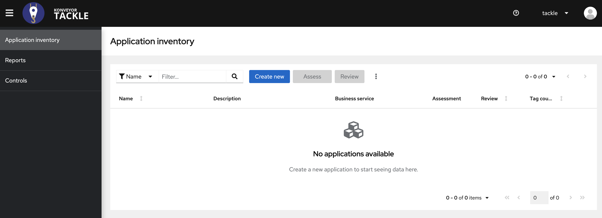
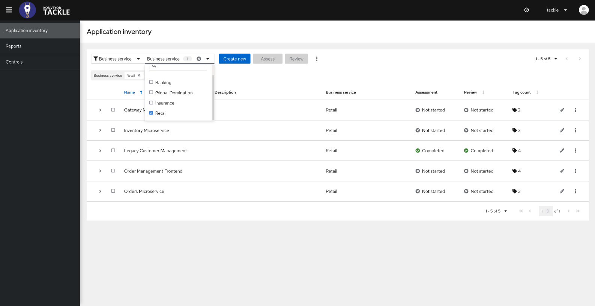
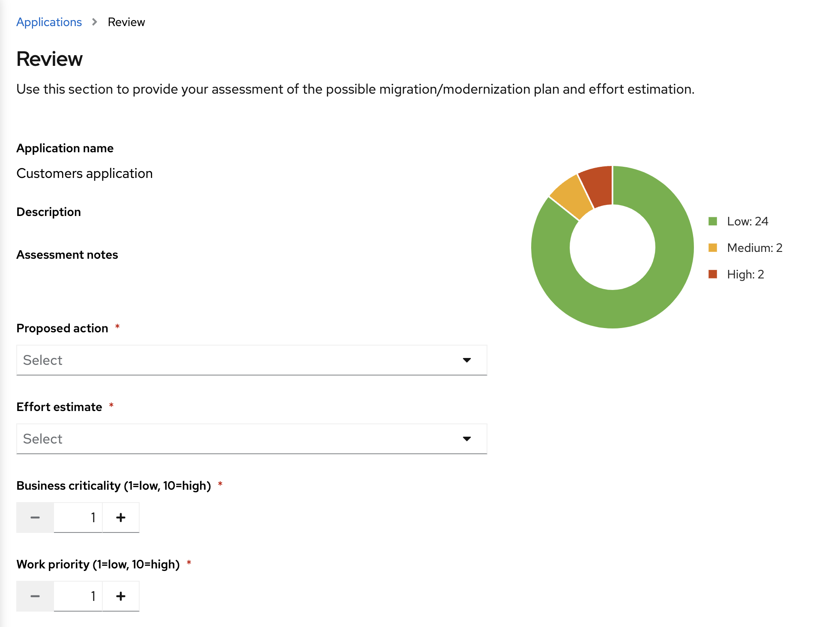

== Assessment

To start the assessment of these applications we will use the Tackle
Application Assessment tool.

The idea behind the application inventory is to allow organizations to
have a holistic view of their application portfolio and serve as the
main integration point for all the Tackle tools like the assessment and
analysis.

Open the Application Inventory UI using the following url (LINK). You’ll
notice we’ve already loaded the existing application portfolio on the
App inventory.

=== Classification

Applications can be classified and grouped in multiple ways, for example
using the business service. Let’s focus on the Retail applications now.

*_Click on ``Filter by business service and enter''Retail”_*

One of the key features of the App Inventory is the extensible tagging
model that allows to classify applications in multiple dimensions.

Let’s focus on the legacy application. We have added tags that represent
its technology, like java, Tomcat and Oracle, and decided to add a
custom tag type that allows us to identify which custom architecture
libraries are used by each application.

*_Expand the legacy customers application._*

Since the legacy application comes from a traditional platform and we
are aware about some problems with the configuration model, let’s focus
on this one for the assessment.

To start the assessment, select the legacy customer application and
click on ``Assess''.

First step will be to enter the different stakeholders involved with the
assessment.

image::../images/stakeholders.png[stakeholders]

*_Once you’re happy with the stakeholders, click on ``Next''._*

The assessment is driven by a questionnaire, and aims to determine the
suitability for containerization for a given application. It covers all
the different areas of the application landscape, including the
technology, application lifecycle mananagement, and operations.

These questions allow the tool to identify potential risks that might
prevent the application from running in containers or would require any
kind of adjustmanr for that.

*_Complete the application details questions and click on ``Next''_*

You will be presented with the review screen.

The review screen allows you to find out which risks were identified
during the assessment and decide which migration strategy to follow
based on that.

*_Scroll down the screen to view the risks._*

This legacy application use a discovery mechanism that is not cloud
friendly, which makes sense since it comes from a classic platform and
accesses a database though a static IP.

*_Sort the risks, highest first_*

Now that we know there will be some changes required in the source code
to adapt the application, we can decide that the strategy will be
``Refactor''

*_Choose ``Refractor'' as strategy and choose ``Small'' effort._*

Since this is a key application in the architecture, we’re going to set
the criticality and priority to ``10''

*_Set Criticality and Priority to ``10''_*

Now that we’ve completed the initial assessment we can see that we will
need to dig deeper into the legacy customers application to check what
the problem is with the config library and how to remove it. To do this
we will use the analysis module of Tacke.

Next link:./3-analyze.adoc[Analyze]
