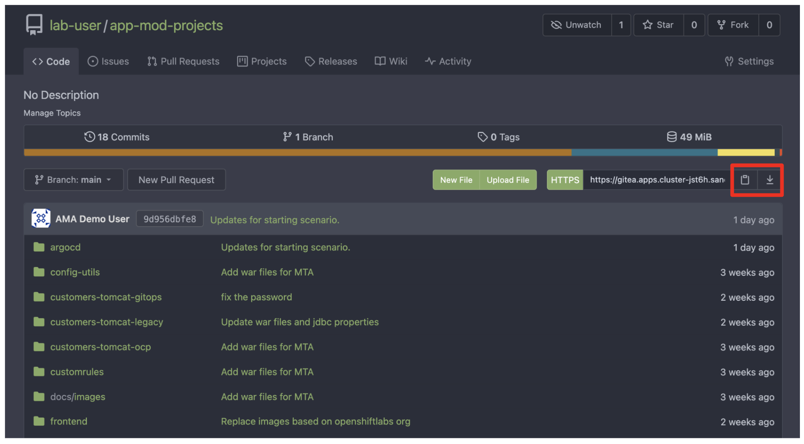
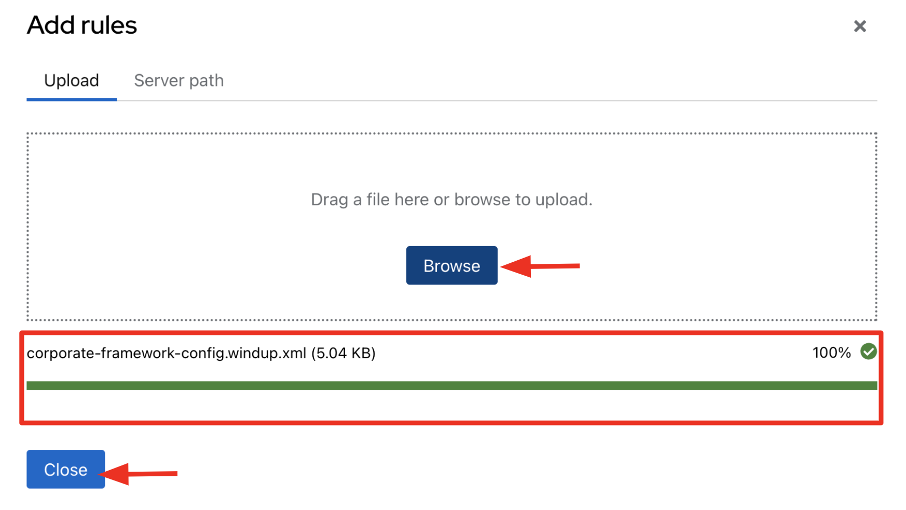
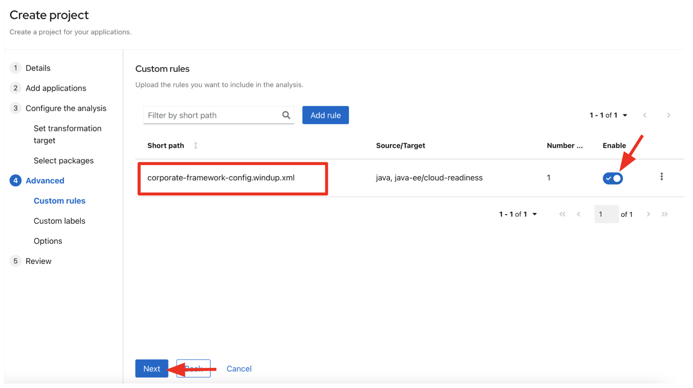

= 3. Analyze - 25 minutes

== Goals of this lab

As you have realized in the previous _assessment_ lab, you need to analyze the legacy applications in terms of identifying actual code of lines for the modernization issues as well as estimating time and effort for the modernization project.

The goal is to analyze the _customers_ application by scanning all source code and properties using the https://developers.redhat.com/products/mta/overview[Migration Toolkit for Applications^] (MTA) tool. Then, you'll understand how to get started with the code modification along with the analysis report.

[NOTE]
====
The main difference between *Tackle* and *MTA* tool is to analyze actual application code. Then the report shows the line of codes for the migration issues and possible solutions to fix the issues.
====

Migration Toolkit for Applications (MTA) is an extensible and customizable rule-based tool that helps simplify migration of Java applications.

image::../images/mta-logo.png[mta-logo]

MTA is also used by organizations for:

* Planning and work estimation
* Identifying migration issues and providing solutions
* Detailed reporting
* Built-in rules and migration paths
* Rule extensibility and customization
* Ability to analyze source code or application archives

Read more about it in the https://access.redhat.com/documentation/en-us/migration_toolkit_for_applications/5.3[MTA documentation^]

== 3.1. Create a New Project in MTA Web Console

Open a new browser to access the MTA web console that is provided from the *shared environment detail page*. Use the following credential.

* Username or email: `mta`
* Password: `password`

image::../images/mta-login.png[mta-login]

Click on `Create project`.

image::../images/mta-1.png[MTA landing page]

Enter a project name as shown below.

* Name: `Customers Service`

image::../images/create-project.png[Create project]

Click on `Next`.

=== 3.1.1. Add applications

First, you need to _download_ or _git clone_ the `app-mod-project` from your _Gitea_ repository. You can find the Gitea URL and credentials in the *shared environment detail page*. 

* Gitea admin username - `opentlc-mgr`
* Gitea admin password - `openshift`

Once you download or clone the project to your local file system, explore if the `customers-tomcat.war` file exists in the *packages-mta* folder.

Go back to the MTA web console. Then, click on `Browse` in the `Add applications` page to select the *customers-tomcat.war* file from your local file system.

image::../images/add-applications.png[Add applications]

Click on `Next`.

=== 3.1.2. Configure the analysis

You will now be presented with options for transformation targets. As this is a tomcat application, we’re *not* going to include the EAP migration path.

[NOTE]
====
JBoss EAP is selected by default in the migration path so you need to deselect it by clicking on it.
====

* `Click the EAP migration path`

image::../images/configure-analysis.png[Configure Analysis]

We will focus on containerizing the application. Since this is going to be a linux container, it makes sense to do a sanity check to avoid and Windows paths might remain in the code from previous iterations. We also going to investigate removing reliance on proprietary JDK licenses, so we going to select OpenJDK as a target.

image::../images/configure-analysis-checked.png[Configure Analysis]

* `Click Containers, Linux, and OpenJDK as the targets`

Click on `Next`.

You will now be presented with options for packages. In order to accelerate the analysis, we will choose only the business packages related to our application. In the case of this application, these classes belong to the `io.konyeyor` package.

Select `all packages` in the *Included packaged* box. Click on `<` arrow button to exclude all packages.

image::../images/packages-exclude.png[Select packages]

There's *no* included packaged on the right box.

image::../images/packages-empty.png[Select packages]

Select only `io.konveyor` package. Then, click on `>` arrow button to include the package.

image::../images/packages.png[Select packages]

Click on `Next`.

=== 3.1.3. Advanced

You will now be presented with options for custom rules.

image::../images/custom-rules.png[Custom rules]

MTA Analysis uses a custom rule engine for the analysis. It comes with many rules out of the box to support the different migration paths, but it can be extended. Custom rules can be developed with a very simple XML syntax and used on the analysis. We've provided some custom rules which will detect the usage of a specific library and make suggestions for changes to be performed to remove it.

Click on `Add Rule` to upload a custom rule (`corporate-framework-config.windup.xml`) in the *customrules* directory that you have already downloaded in your file system.

Click on `Close`. Make sure to enable the custom rule by clicking the toggle button. Click on `Next`.

Then, you will now be presented with options for labels.

image::../images/labels.png[Labels]

No custom labels are required for this analysis. Click on `Next`.

You will now be presented with options to fine tune the analysis, for the moment we will stick with the default options.

image::../images/fine-tune.png[Fine tuning]

Click on `Next`.

Lastly, we are presented with a summary of the configuration for our analysis. 

image::../images/finish-project.png[Finish project]

Click on `Save and run`.

Now the analysis has been scheduled, and once it is finished we will be able to access the reports. Stay on this view until the analysis is finished.

image::../images/active-analysis.png[Active analysis]

== 3.2. Understanding the report

The Dashboard gives an overview of the entire application migration effort. It summarizes:

* The incidents and story points by category
* The incidents and story points by level of effort of the suggested changes
* The incidents by package

[NOTE]
Story points are an abstract metric commonly used in Agile software development to estimate the relative level of effort needed to implement a feature or change. Migration Toolkit for Application uses story points to express the level of effort needed to migrate particular application constructs, and the application as a whole. The level of effort will vary greatly depending on the size and complexity of the application(s) to migrate.

Once the report is finished, click on the link to access the report. Click on `customers-tomcat.war` application.

image::../images/report-view.png[View report]

The reports provide all kinds of information about the application, like the technologies it uses, dependencies, but most importantly issues that need to get fixed.

image::../images/report-dashboard.png[report dashboard]

Click on the `Issues` tab.

This view shows us the list of issues that prevent an application to run on the target runtime. We can see that the application has a few mandatory issues that need to be addressed.

Click on `Hard coded IP address`.

By choosing the issue we can see where it was detected and view a hint on how to solve it.  It looks like the config files are pointing to some static IPs.

image::../images/report-hint.png[report hint]

Click on `File system issue`.

It looks like a problem has been detected on some class coming from the config library. We are analyzing the binary, so the dependencies have been analyzed as well.

image::../images/report-hint-fs.png[report hint file system]

Expand the `Legacy configuration issue`.

It looks like the custom rule got triggered and found some issues with the source code. This rule detects the use of a custom configuration library and gives some hints about what needs to be done to fix it.

image::../images/report-hint-custom.png[report hint custom rule]

Click on the `file to view the source code`.

The legacy ApplicationConfiguration class is being used in this application. 

image::../images/report-code.png[report code]

You analyzed the legacy application to learn what migration issues you have. You'll refactor the application to fix the issues using an Integrated Development Environment (IDE) tool in the next section.

➡️ link:./4-refactor.adoc[4. Refactor]

⬅️ link:./2-assessment.adoc[2. Assessment]