== Analyze application code

To perform an analysis of the application code, we will use the Tackle
Application Assessment tool

To start the analysis tool, click on the following [LINK]

image::../images/mta-1.png[MTA landing page]

*_Click on create project and enter a project name as shown below_*

image::../images/create-project.png[Create project]

*_Click on ``Next''_*

From the ``Add applications'' page, click on browse to select the WAR
file for analysis, the file is located in the TODO folder

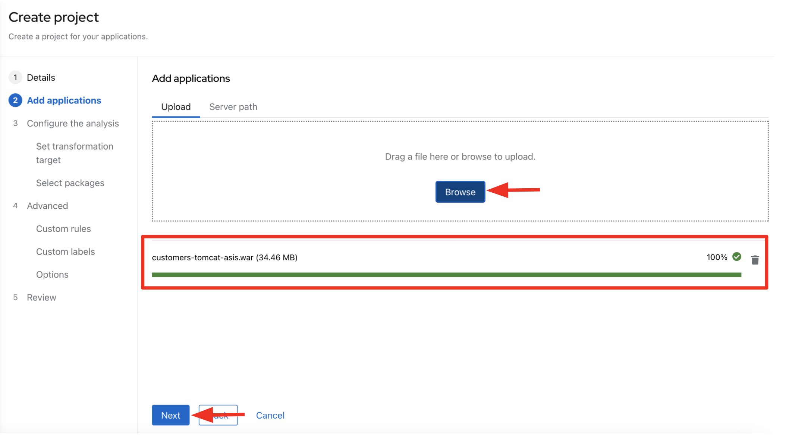

*_Click on ``Next''_*

You will now be presented with options for transformation targets.

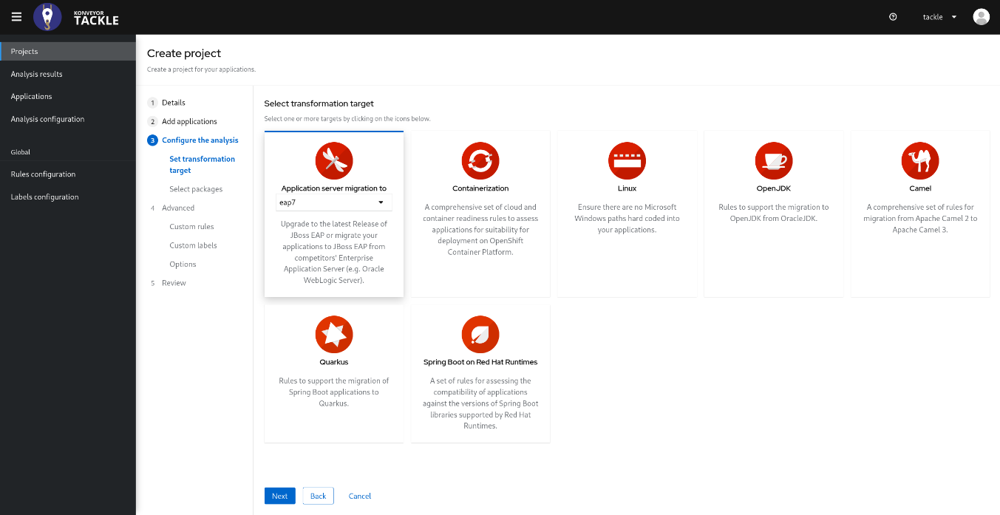

As this is a tomcat application, we’re going to uncheck the EAP
migration path

*_Uncheck the EAP migration path_*

We will focus on containerizing the application. Since this is going to
be a linux container, it makes sense to do a sanity check to avoid and
Windows paths might remain in the code from previous iterations. We also
going to investigate removing reliance on proprietary JDK licenses, so
we going to select OpenJDK as a target.

*_Check Containers, Linux, and OpenJDK as the targets_*

*_Click on 'Next'_*

You will now be presented with options for packages.

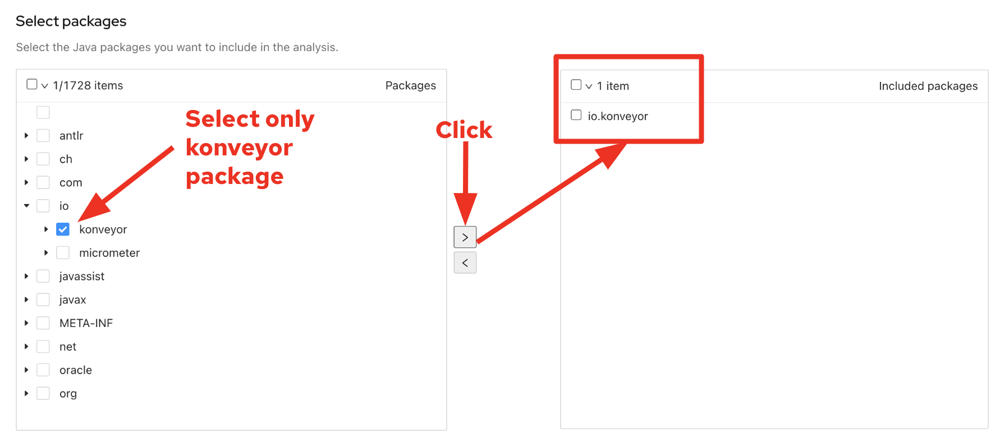

In order to accelerate the analysys, we will choose only the business packages related to our application. In the case of this application, these classes belong to the 'io.konyeyor' package.  Ensure only 'io.konyeyor' is selected and click on the ">" button to move to include these packages.

*_Click on 'Next'_*

You will now be presented with options for custom rules.

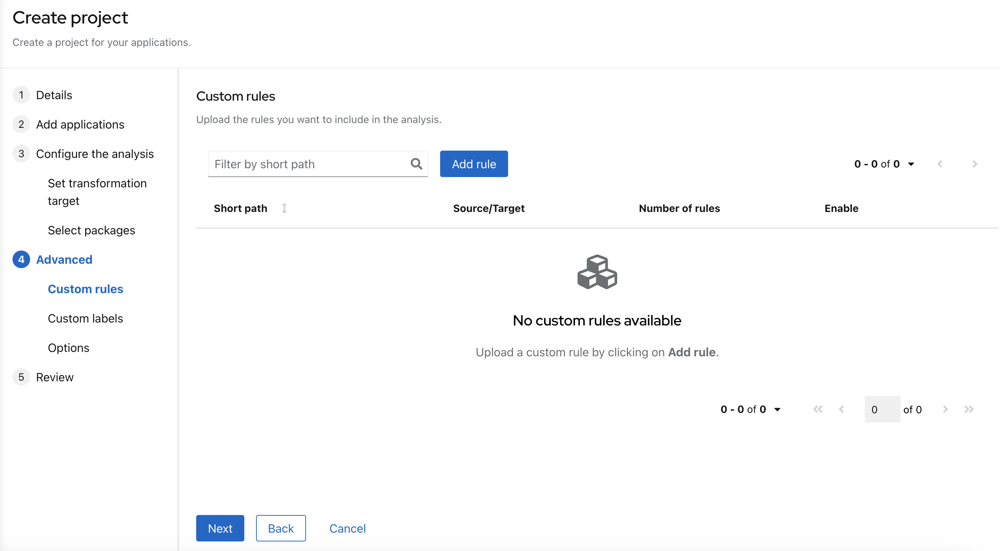

Tackle Analysis uses a custom rule engine for the analysis. It comes with many rules out of the box to support the different migration paths, but it can be extended. Custom rules can be developed with a very simple XML syntax and used on the analysis.
We've provided some custom rules which will detect the usage of a specific library and make suggestions for changes to be performed to remove it.  

*_Click on 'Add Rule'_*

*_Upload the provided rules file_*  

// TODO: provide location for rule file

*_Click on 'Next'_*

You will now be presented with options for labels.

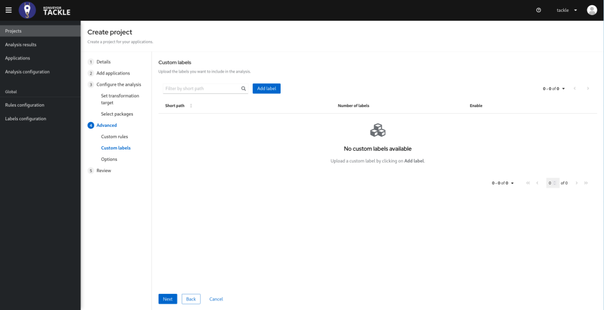

No custom labels are required for this analysis.

*_Click on 'Next'_*

You will now be presented with options to fine tune the analysis, for the moment we will stick with the default options.

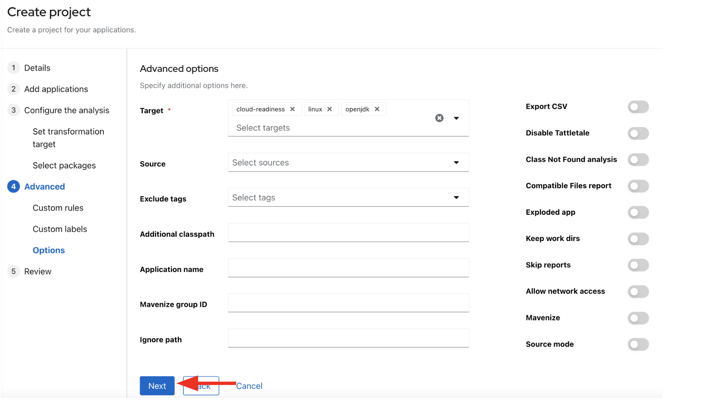

*_Click on 'Next'_*

Lastly, we are presented with a summary of the configuration for our anaysis. 

image::../images/finish-project.png[Finish project]

*_Click on 'Save and run'_*

Now the analysis has been scheduled, and once it is finished we will be able to access the reports.  Stay on this view until the analysis is finished.

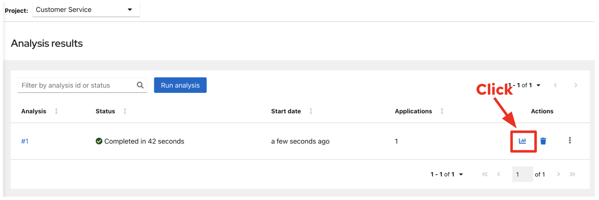

Once the report is finished, click on the link to access the report.

// TODO update link with correct wording

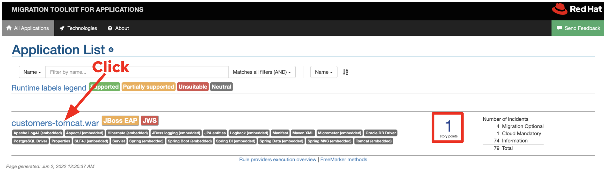

*_Click on the customers application_*

The reports provide all kinds of information about the application, like the technologies it uses, dependencies, but most importantly issues that need to get fixed.

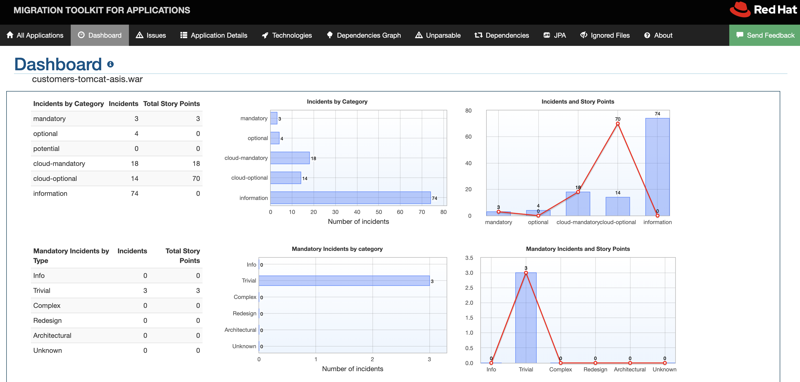

*_Click on the issues tab_*

This view shows us the list of issues that prevent an application to run on the target runtime,  We can see that the application has a few mandatory issues that need to be addressed.

*_Click on 'Hard coded IP address'_*

By choosing the issue we can see where it was detected and view a hint on how to solve it.  It looks like the config files are pointing to some static IPs.

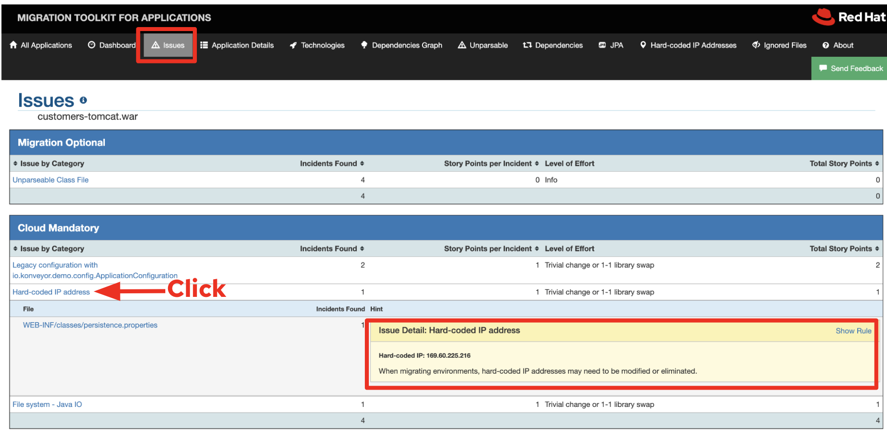

*_Click on 'File system issue'_*

It looks like a problem has been detected on some class coming from the config library.  We are analyzing the binary, so the dependencies have been analyzed as well.

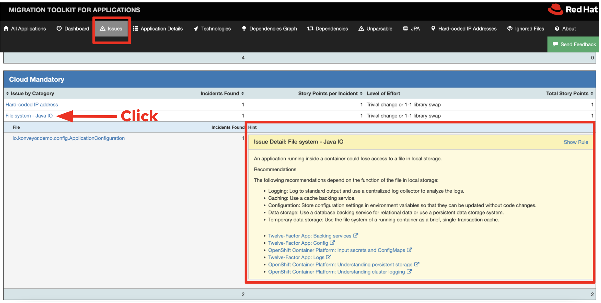

*_Expand the 'Legacy configuration issue'_*

It looks like the custom rule got triggered and found some issues with the source code.  This rule detects the use of a custom configuration library and gives some hints about what needs to be done to fix it.

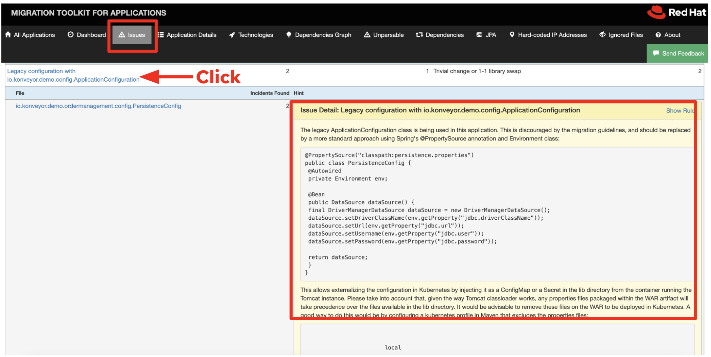

*_Click on the file to view the source code_*

We can now see exactly where the issue is located in the source code.  But we are still using a web environment.  We could check these reports for the changes, but that's not practical.  Because of that we developed a series of plugins for the most popular IDEs to make the like of the developer easier.

image::../images/report-code.png[report code]

*_Switch to the IDE_*

// TODO: How to switch to the IDE?

Next link:./4-refactor.adoc[Step 4- Refactor]