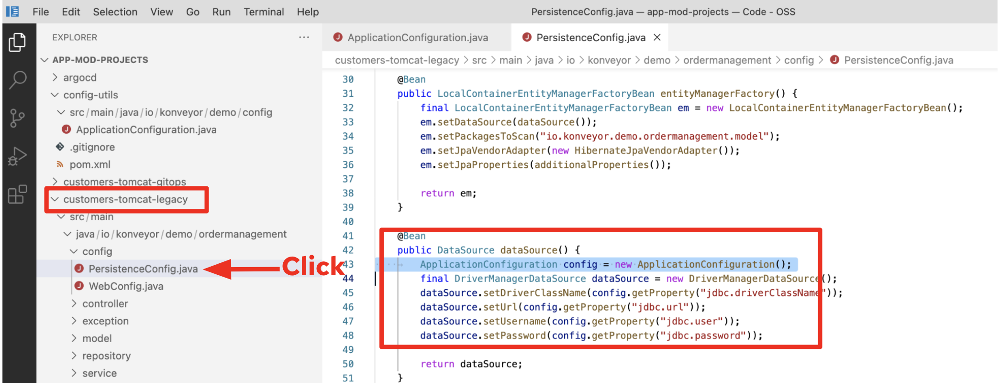

== Refactor application code

//TODO: Validate these steps

Switch to the VS Code server ui, the project should already be open and the IDE plugin already installed and ready to go.

*_Click on the MTA plugin view_*

We can configure the MTA plugin to perform the exact same analysis that we ran on the Web Console.

//TODO: Fill out steps needed to run report within the IDE.

Once the config is ready, we can just click on run and it will execute locally and provide the results right there in the IDE.  

We can access the exact same reports that get generated on the web console, but the cool thing is seeing the results in the IDE.  In this case, we can see it has found some issues in the PersistenceConfig class, let's take a look to see what the issue is.

*_Navigate in the issue tree to the PersistenceConfig class_*

We have two occurences of the issue from out custom rule in this class.  If you click on it, it brings you to the extact place in the source code.

*_Click on the issue_*

To know exactly what happened, I can see the details to understand what needs to be changed.

*_Right click on the issue and click on view details_*

image::../images/issue-details.png[Issue details]

We can put the issue description side by side with the code to make things easier.

*_Move the issue details view to the right and have it side by side with the source code from the PersistenceConfig class_*

image::../images/issue-side-by-side.png[Issue side by side]

//TODO implement the changes required to resolve the issue.

Once the code changes are made. we would need to have the deployment manifests to have the application running in Kubernetes, along with the image required for this type of application.  That is something that the MOve2Kube project can infer right from the source code.

Next link:./5-deploy-to-kubernetes.adoc[Step 5 deploy to kubernetes]
