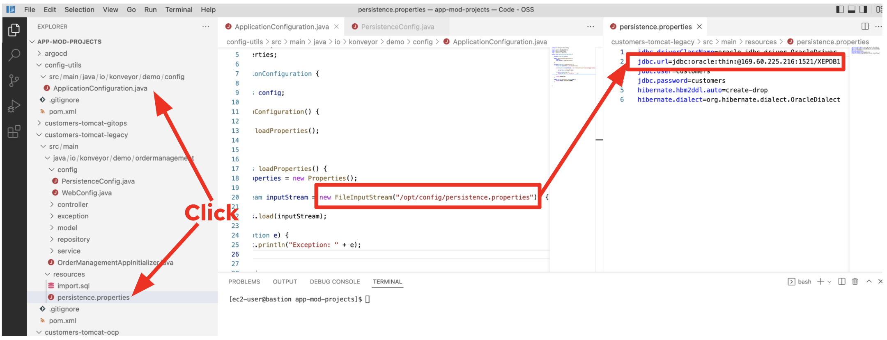
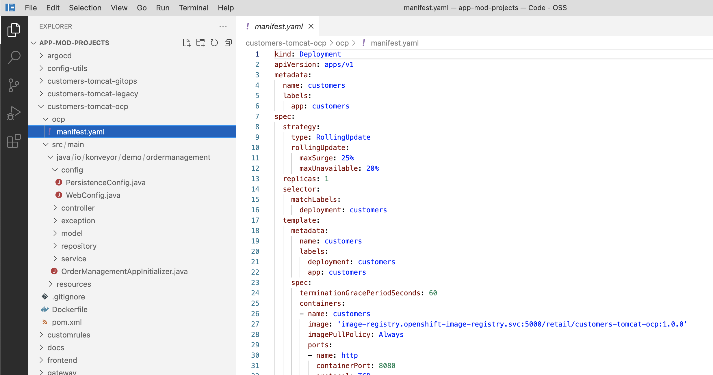
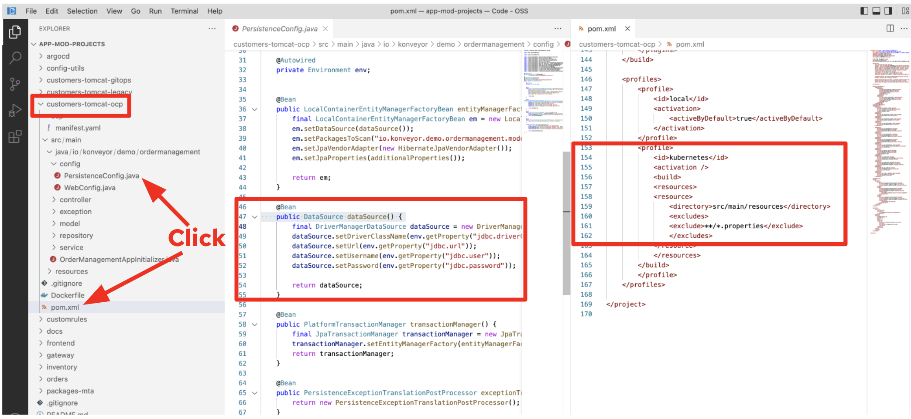

= Refactor

In this step you will modernize the customers application to fix the analyzed issues (e.g. _Hard coded IP address_).

Open a new browser to access the VSCode server that is provided from the e-mail. Use the following credential.

* Password: `password`

image::../images/vscode-server-login.png[vscode-server-login]

== Explore the Migration issues

According to the analysis report, the migration issues are to use the external configurations with hard coded static IP addresses. Let's dig into the issue on the code level. Go to `customers-tomcat-legacy` project in VSCode server. Then, open `PersistenceConfig.java` file in *src/main/java/io/konveyor/demo/ordermanagement/config* directory.

image::../images/persistence-class.png[persistence-class]

The *dataSource()* method creates an `ApplicationConfiguration` instance to configure the JDBC variables such as _driverClassName_, _url_, _user_, and _password_. The ApplicationConfiguration ends up with referring to the hard coded IP address in `persistence.properties`.

== Understand the Solution

The `customers-tomcat-ocp` project implements the *Customers* application with all the required changes and deploy the applications to OpenShift (Kubernetes). It also defines an OpenShift manifests file in the `ocp` directory.

Let's find out how to fix the above configuration issue. Move to `customers-tomcat-ocp` project. Then, open `PersistenceConfig.java` file in *src/main/java/io/konveyor/demo/ordermanagement/config* directory and `pom.xml` file.

image::../images/persistence-class-ocp.png[persistence-class-ocp]

*ApplicationConfiguration* class isn't required anymore to configure the JDBC variables but the *datasource* method still needs to use the environment instance. When you take a look at the *pom.xml*, the static properties file will be excluded when the application is building. 

Using the kubernetes profile in the build is essential for the application to pick up the configuration file injected via a secret in the pod. That secret also has to be  created manually with the following command from the customers-tomcat-ocp directory:

[source,sh]
----
mvn clean package -P kubernetes
----

Luckily, We already have the solution artifact (`customers-tomcat-solution.war`) in the https://github.com/redhat-mw-demos/app-mod-projects/tree/main/packages-mta[packages-mta^] folder. Download the WAR file and go back to the MTA web console.

Create a new project, `New Customers Service` to analyze the solution artifact. Once the report is finished, verify that it now reports `0` Story Points.

You have successfully migrated this app to OpenShift, *congratulations!*

image::../images/report-solution-view.png[View report] 

➡️ Next section: link:./5-rehost.adoc[5 - Rehost]
