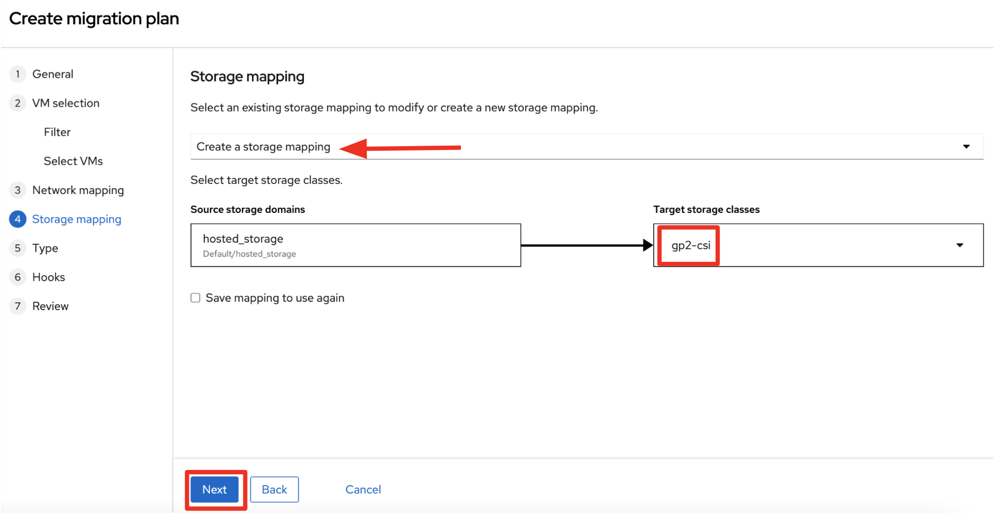

= Rehost

The steps you will follow to migrate the *customers* service from Red Hat Enterprise Virtualization (RHV) to Red Hat OpenShift are as follows:

* Migrate the *Oracle VM* from RHV to OpenShift Virtualization using the OpenShift Migration Toolkit for Virtualization
* Modernize the Java source code for the *customers* application
* Use the https://tekton.dev/[Tekton^] Pipeline to build and deploy the new, modernized application using Red Hat Web Server instead of Apache Tomcat as the runtime.
* Set up the configuration for the *customers* service to connect to the Oracle database VM which is now running on OpenShift Container Platform
* Test the *customers* service
* Update the configuration for the *gateway* service to now point to the modernized *customers* service.
* Demonstrate that your *frontend* service still works as before.

=== Migrate the Oracle VM from RHV to OpenShift

==== Prerequisites

Download the CA Certificate for your RHV environment. You need to do that on your laptop because you will need to drag the file into the Migration Toolkit for Virtualization (MTV) console later.

Set this variable to the RHV hostname from the e-mail. 

Open a new browser to access the following URL. Make sure to replace `RHV_HOSTNAME`` with the hostname from your welcome e-mail (e.g., *rhvm.dev.cnv.infra.opentlc.com*).

[source,sh]
----
https://<RHV_HOSTNAME>/ovirt-engine/services/pki-resource?resource=ca-certificate&format=X509-PEM-CA
----

On most systems this will download a file `pki-resource.cer` into your `Downloads` folder. Take a note where this file got downloaded to. You will need it a little bit later.

=== Set up Virtualization Provider in MTV

Log into the OpenShift Web Console from the e-mail.

* Username: `admin`
* Password: `r3dh4t1!`

image::../images/ocp-login.png[ocp-login]

Go to `Virtualization` on the left menu and click on `Virtual Machines`. From the *Projects* drop down select the *retail* project. There are no Virtual Machines yet.

image::../images/ocp-vm.png[ocp-vm]

Click `Launch Migration Tool` to launch the OpenShift Migration Toolkit for Virtualization.

Log in using your *admin* credentials.

* Username: `admin`
* Password: `r3dh4t1!`

If this is the first time you are logging in, click on `Get started` button.

image::../images/mtv-get-started.png[mtv-get-started]

Click `Add provider` on the list of *Providers*.

image::../images/mtv-add-provider.png[mtv-add-provider]

Select *Red Hat Virtualization* from the list of providers. Fill in the information from your e-mail.

* Name: `rhv`
* RHV Manager host name or IP address*: The hostname from your e-mail (e.g., `rhvm.dev.cnv.infra.opentlc.com`)
* RHV Manager user name: the username from your e-mail. (e.g., `migrateuser-96trd@internal`)
* RHV Manager passsword: the password from yoru e-mail. (e.g., `ThvA2Ioa6Q4G`)
* CA Certificate: Drop the previously downloaded CA Certificate File

Click `Add`.

image::../images/mtv-add-provider-detail.png[mtv-add-provider-detail]

MTV will validate your provider and after a few seconds the status should switch to *Ready*.

image::../images/mtv-add-provider-ready.png[mtv-add-provider-ready]

=== Create and execute Migration Plan

Go to `Migration Plans` in the Migration Toolkit for Virtualization console. Click `Create Plan`.

image::../images/mtv-create-plan.png[mtv-create-plan]

On the *General settings* page use the following parameters.

* Plan name: `customers-database`
* Source provider: `rhv`
* Target provider: select *host* (the OpenShift cluster you are currently on)
* Target namespace*: select *retail*

Click `Next`.

image::../images/mtv-plan-general.png[mtv-plan-general]

Check `All datacenters` on the *Filter by VM location*. Click `Next`.

image::../images/mtv-plan-vm-loc.png[mtv-plan-vm-loc]

Select the Oracle VM (e.g. _oracle-96trd_) in your welcome e-mail on the *Select VMs* page. Click `Next`.

image::../images/mtv-select-vm.png[mtv-select-vm]

Click on *Select a network mapping* on the *Network Mapping* page. Then, Select `Create a network mapping`. Leave the defaults and click `Next`.

image::../images/mtv-select-nw.png[mtv-select-nw]

Click on *Select a storage mapping* on the *Storage Mapping* page. Select `Create a storage mapping`.

Change the *Target Storage Class* to `gp2-csi` and click `Next`.

Select `Cold migration` on the *Migration type* page. Click `Next`.

image::../images/mtv-select-cold.png[mtv-select-cold]

Click `Next` on the *Hooks* page.

image::../images/mtv-select-hook.png[mtv-select-hook]

Click `Finish` on the *Review* page.

image::../images/mtv-review.png[mtv-review]

Now your Migration Plan is ready to use. To execute the plan click on `Start` button in the *customers-database* migration plan.

image::../images/mtv-plan-ready.png[mtv-plan-ready]

Confirm by clicking the blue `Start` button in the popup window.

image::../images/mtv-plan-start.png[mtv-plan-start]

Because you are running a *cold migration* the VM in RHV gets shutdown first.

The migration will take about _15 - 25_ minutes after which you will have a running Oracle database VM in your OpenShift cluster.

image::../images/mtv-plan-complete.png[mtv-plan-complete]

Once the migration succeeds you will find a VM called `oracle-xxxxx` in your retail namespace.

image::../images/mtv-plan-complete-ocp.png[mtv-plan-complete-ocp]

=== Post Migration Tasks

The VM is not yet reachable from other applications on the cluster. You will need to add a label to the VM and then create a service to be able to connect to the database on the VM.

Add a label to your VM's template metadata and make sure to replace `{GUID}` with your GUID.

[source,sh]
----
oc patch vm oracle-{GUID} --type=merge --patch='{"spec": { "template": { "metadata": { "labels": { "app": "oracle-{GUID}"}}}}}' -n retail
----

Restart the VM for the VM Pod to pick up the new label. Go back to the `VirtualMachines` menu in the OpenShift Web Console. Click on your VM.

From the *Action* drop down select *Restart* then confirm by clicking *Restart* in the pop up dialog.

image::../images/restart-vm.png[restart-vm]

Create service for the database vm:

[source,sh]
----
oc create service clusterip oracle-{GUID} --tcp=1521:1521 --tcp=2022:22 -n retail
----

Make sure your service has the endpoint for the Oracle VM pod as an Endpoint:

[source,sh]
----
oc describe svc oracle-{GUID} -n retail
----

* Sample Output

[source,texinfo]
----
Name:              oracle-96trd
Namespace:         retail
Labels:            app=oracle-96trd
Annotations:       <none>
Selector:          app=oracle-96trd
Type:              ClusterIP
IP Family Policy:  SingleStack
IP Families:       IPv4
IP:                172.30.99.143
IPs:               172.30.99.143
Port:              1521-1521  1521/TCP
TargetPort:        1521/TCP
Endpoints:         10.128.1.156:1521
Port:              2022-22  2022/TCP
TargetPort:        22/TCP
Endpoints:         10.128.1.156:22
Session Affinity:  None
Events:            <none>
----

➡️ Next section: link:./6-deploy-to-kubernetes.adoc[6 - Deploy to Kubernetes]