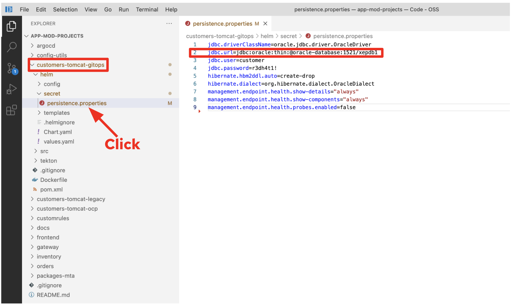

= Deploy to Kubernetes

In this step you will build and deploy the modernized customer application to OpenShift using https://docs.openshift.com/container-platform/4.10/cicd/pipelines/understanding-openshift-pipelines.html[OpenShift Pipelines^] and https://docs.openshift.com/container-platform/4.10/cicd/gitops/understanding-openshift-gitops.html[GitOps^].

As stated before, one of the main focus areas of the application modernization journey is to showcase a modern approach for CI/CD using a set of tools and practices around the GitOps paradigm. For that, a Deployment Pipeline for the Customers application has been developed using OpenShift Pipelines based on https://tekton.dev/[Tekton^]. The following diagram depicts all tasks to be executed by the pipeline and its interaction with external systems and tools:

image::../images/ocp-pipeline.png[ocp-pipeline]

Each of these tasks can be described as follows:

* *Clone Repository* downloads the source code from the target Git repository.
* *Build from Source* builds the application artifact from source code. This task has been tweaked to allow selecting the target subdirectory from the repository in which the target application source is available, allowing to have several application/components available in a single repository. *This way of versioning different services/components is highly discouraged*, as the optimal approach would be to have a dedicated repository for each component since their lifecycle should be independent. Nevertheless, this choice was made to gather all demo materials on a single repository for simplicity purposes.
* *Build Image* uses the Dockerfile packaged on the root directory of an application to build an image and push it to the target registry. The image will be tagged with the short commit hash of the source it contains.
* *Update Manifest* uses the short commit hash tag to update the application manifest in Git and point to the newly built image. Application deployment is then delegated to ArgoCD, which is continuously polling the configuration repository for changes and creates/updates all OpenShift objects accordingly.

The pipeline accepts the following parameters:

* *git-url*: URL of the target Git repository.
* *git-branch*: target branch to work with. (_default: main_)
* *app-subdir*: Subdirectory from the repository in which the application source code is stored.
* *target-namespace*: Namespace/project in which to deploy the application.
* *target-registry*: Registry to push the built image to. (_default: image-registry.openshift-image-registry.svc:5000_)

== Update Oracle DMBS Connection

The *customers* application in the OpenShift cluster has a connection failure because the application still tries to connect to the Oracle database running on RHV. 

To fix the issue, you need to update the *JDBC* configuration that points to the migrated Oracle database on OpenShift virtualization.

Go back to the VS Code server and open the `persistence.properties` file in *customer-tomcat-gitops/helm/secret* directory.

Update the `jdbc.url` value to your Oracle virtual machine's name (e.g. _oracle-96trd_) on OpenShift. It should look somewhat like this:

[source,yaml]
----
jdbc.url=jdbc:oracle:thin:@ooracle-96trd:1521/xepdb1
----

Save the file.

Open a terminal in VS Code, run the following `git config` command before you _commit_ and _push_ changes.

[source,sh]
----
git config --global user.email "opentlc-mgr@opentlc.com"
git config --global user.name "opentlc-mgr"
----

Switch to the `Source Control` menu in VSCode. Click on `+` button to add the changes (_persistence.properties_).

Type `Update jdbc.url` in the comment. Then, commit it(e.g. _Command + Enter on macOS_) and cick on `Sync Changes`.

image::../images/vscode-commit.png[vscode-commit]

== Run an OpenShift Pipeline

In the future we will have a trigger and event listener on the pipeline. But for now you have to kick off the pipeline run manually

. Log into OpenShift Web Console
. Navigate to *Pipelines* -> *Pipelines*
. Click the dots menu to the right of the pipeline `customers-deployment-pipeline` and select *Start last run*

➡️ Next section: link:./7-enhance-apps.adoc[7 - Enhance Applications with Managed Services]