= 6. Deploy to Kubernetes - 30 minutes

== Goals of this lab

The goal is that you will build and deploy the modernized customer application to OpenShift using https://docs.openshift.com/container-platform/4.10/cicd/pipelines/understanding-openshift-pipelines.html[OpenShift Pipelines^] and https://docs.openshift.com/container-platform/4.10/cicd/gitops/understanding-openshift-gitops.html[GitOps^].

* Use the https://tekton.dev/[Tekton^] Pipeline to build and deploy the new, modernized application using Red Hat JBoss Web Server instead of Apache Tomcat as the runtime.
* Set up the configuration for the *customers* service to connect to the Oracle database VM which is now running on OpenShift Container Platform
* Test the *customers* service
* Update the configuration for the *gateway* service to now point to the modernized *customers* service.
* Demonstrate that your *frontend* service still works as before.

== 6.1. Update Oracle DMBS Connection using Helm

=== 6.1.1. Why OpenShift with Helm?

https://docs.openshift.com/container-platform/4.10/applications/working_with_helm_charts/understanding-helm.html[Helm^] is a package and install manager that standardizes and simplifies packaging and deployment of containerized applications with Kubernetes, anywhere in the hybrid cloud. Helm lets developers package their applications so that they can be easily shared and deployed by anyone in their organization and beyond. 

Helm can also be used to automate *day-1* tasks like installation and basic configuration management for setting up the applications, and some *day-2* operations like performing some simple upgrades and rollbacks.

=== 6.1.2. Update the Helm Chart for a new JDBC configuration

The *customers* application in the OpenShift cluster has currently a connection failure because the application still tries to connect to the Oracle database running on RHV. To fix the issue, you need to update the *JDBC* configuration that points to the migrated Oracle database on OpenShift virtualization.

[IMPORTANT]
====
To save your time to go through the hands-on labs today, our SRE team has already migrated the VM running Oracle database to the OpenShift virtualization in the *retail-userXX* project.  
====

The JDBC configuration is currently managed by the _helm chart_ to automate day 1 & 2 operations for the modernized Globex retail system. Let's go back to the *VS Code server* and open the `persistence.properties` file in *customer-tomcat-gitops/helm/secret* directory.

image::../images/gitops-persistence.png[gitops-persistence]

Update the `jdbc.url` value to the Oracle virtual machine's name (`oracle-database`) on OpenShift. It should look like this:

[source,yaml]
----
jdbc.url=jdbc:oracle:thin:@oracle-database:1521/xepdb1
----

[NOTE]
====
Where is the `Save` button? VS Code server will autosave your changes, that is why you can’t find a `SAVE` button - no more losing code because you forgot to save. You can undo with `CTRL-Z` or `CMD-Z` or by using the `Edit -> Undo` menu option.
====

Switch to the `Source Control` menu in VSCode. Click on `+` button to add the changes (_persistence.properties_).

Type `Update jdbc.url` in the comment. Then, commit it(e.g. _Command + Enter on macOS_) and click on `Sync Changes`.

image::../images/vscode-commit.png[vscode-commit]

Access your `Gitea` repository (e.g. _https://gitea.apps.cluster-l6kxh.sandbox541.opentlc.com_) in the *shared environment detail page* with the following credentials:

* Gitea admin username: `userXX`
* Gitea admin password: `openshift`

Once you logged in to the Gitea admin console, you will see the latest commit (e.g. _08fb9fb6f4 Update jdbc.url_).

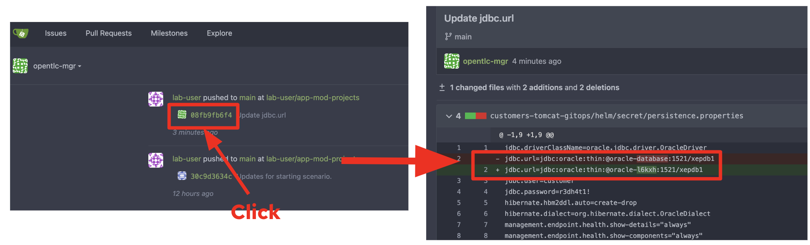

== 6.2. Run an OpenShift Pipelines

=== 6.2.1 Why OpenShift Pipelines?

OpenShift Pipelines provides a *kubernetes-native CI/CD* framework based on https://tekton.dev[Tekton^] to design and run your pipelines, and is designed to run each step of the CI/CD pipeline in its own container, allowing each step to scale independently to meet the demands of the pipeline.

By extending Kubernetes/OpenShift with Custom Resource Definitions (CRDs), OpenShift Pipelines makes CI/CD concepts such as `pipeline`, `task`, and `step` natively in terms of increasing the scalability, security, ease of deployment capabilities of Kubernetes.

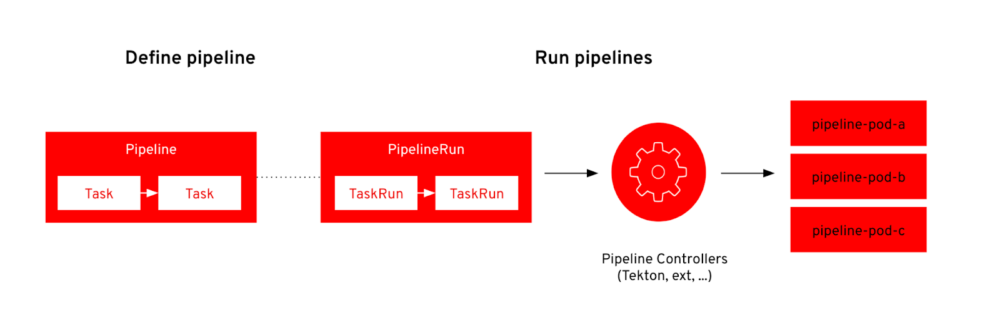

Each of these tasks can be described as follows:

* *Clone Repository* downloads the source code from the target Git repository.
* *Build from Source* builds the application artifact from source code. This task has been tweaked to allow selecting the target subdirectory from the repository in which the target application source is available, allowing to have several application/components available in a single repository. *This way of versioning different services/components is highly discouraged*, as the optimal approach would be to have a dedicated repository for each component since their lifecycle should be independent. Nevertheless, this choice was made to gather all demo materials on a single repository for simplicity purposes.
* *Build Image* uses the Dockerfile packaged on the root directory of an application to build an image and push it to the target registry. The image will be tagged with the short commit hash of the source it contains.
* *Update Manifest* uses the short commit hash tag to update the application manifest in Git and point to the newly built image. Application deployment is then delegated to ArgoCD, which is continuously polling the configuration repository for changes and creates/updates all OpenShift objects accordingly.

The pipeline accepts the following parameters:

* *git-url*: URL of the target Git repository.
* *git-branch*: target branch to work with. (_default: main_)
* *app-subdir*: Subdirectory from the repository in which the application source code is stored.
* *target-namespace*: Namespace/project in which to deploy the application.
* *target-registry*: Registry to push the built image to. (_default: image-registry.openshift-image-registry.svc:5000_)

=== 6.2.2 Execute the Customers Pipelines

In the future we will have a trigger and event listener on the pipeline. But for now you have to kick off the pipeline run manually.

First, open a new browser to access the OpenShift web console that is provided from the *shared environment detail page*. 

image::../images/openshift_login.png[openshift_login]

Login using your credentials:

Username: `userXX`

Password: `openshift`

Then, switch project to `cicd-userXX` in _Developer perspective_. 

Click on `Pipelines` on the left menu. You will see pre-defined `customers-deployment-pipeline` pipeline. Click on the pipeline.

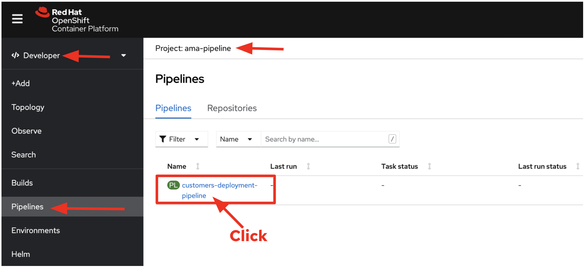

Click on `Start` in *Actions* dropbox to run the pipeline.

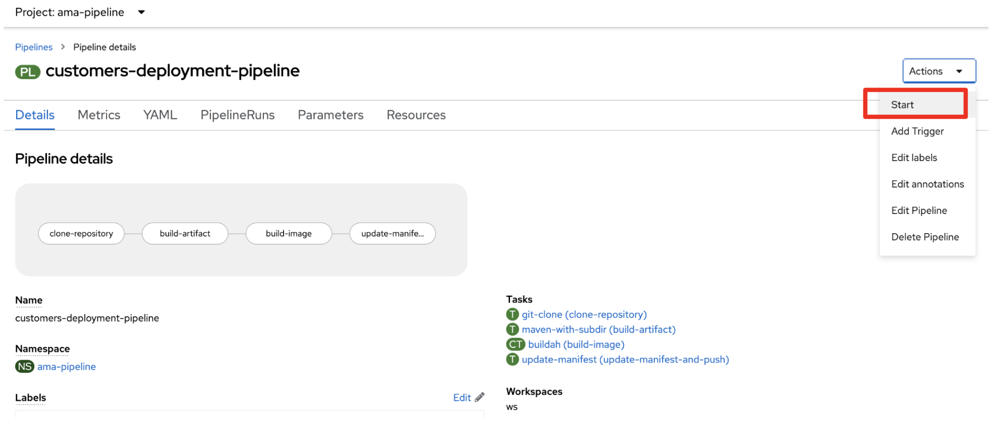

A *PipelineRun* is how you can start a pipeline and tie it to the Git and image resources that should be used for this specific invocation.

This dialog box is where you bind the final target values for the source repo of the _build-artifact_ step, and the target namespace to deploy in the _update-manifest-and-push_ step. Input the parameter and select resources as below then Click on *Start*:

* git-url: `https://YOUR_GITEA_URL`
* git-branch: `main`
* app-subdir: `customers-tomcat-gitops`
* target-namespace: `retail-userXX`
* target-registry: `image-registry.openshift-image-registry.svc:5000`
* ws: `customers-pvc` in *PersistentVolumeClaim*

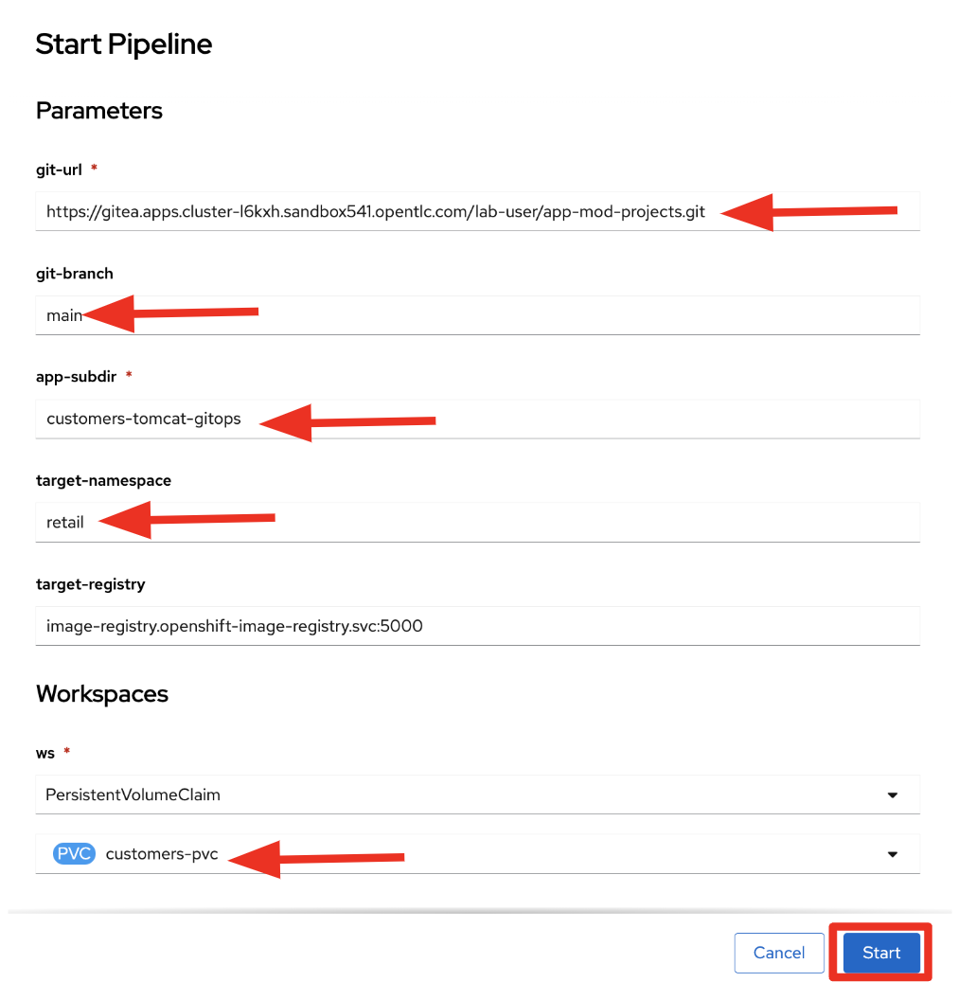

As soon as you started the *customers-deployment-pipeline* pipeline, a _pipelinerun_ is instantiated and pods are created to execute the tasks that are defined in the pipeline. After a few minutes, the pipeline should finish successfully. You can hover over the steps to get a quick snapshot of the step’s progress, or click on the steps to see detailed logs of the steps.

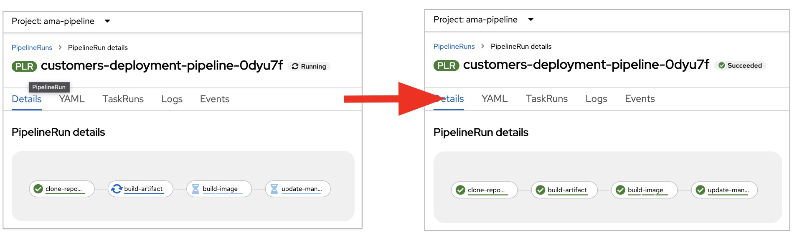

=== 6.2.3 Add Labels for better Topology View

Globex retail system has deployed multiple microservices to the OpenShift cluster as well as each microservices has complex relations with the other microservices and databases. This architecture might not be understandable quickly and easily for developers and SREs. Luckily, OpenShift developer console provides a decent `topology` view with adding labels and annotations. It makes the topology view more clear and explicit relations among deployed applications in the same namespace.

Add following labels and annotations to show which _languages_, _frameworks_, and _runtimes_ are used for each application by running the following `oc` commands in terminal on the VS Code server where you logged in to the OpenShift cluster.

Run the following command in the VS Code server terminal. Be sure to replace `userXX` with your *username*.

[source,sh]
----
oc project retail-userXX && \
oc label deployment/inventory app.kubernetes.io/part-of=inventory app.openshift.io/runtime=quarkus --overwrite && \
oc label deployment/postgresql-inventory app.kubernetes.io/part-of=inventory app.openshift.io/runtime=postgresql --overwrite && \
oc annotate deployment/inventory app.openshift.io/connects-to=postgresql-inventory --overwrite && \
oc label deployment/orders app.kubernetes.io/part-of=orders app.openshift.io/runtime=spring --overwrite && \
oc label deployment/postgresql-orders app.kubernetes.io/part-of=orders app.openshift.io/runtime=postgresql --overwrite && \
oc annotate deployment/orders app.openshift.io/connects-to=postgresql-orders --overwrite && \
oc label deployment/customers app.kubernetes.io/part-of=customers app.openshift.io/runtime=tomcat --overwrite && \
oc label deployment/ordersfrontend app.kubernetes.io/part-of=ordersfrontend app.openshift.io/runtime=nodejs --overwrite && \
oc annotate deployment/ordersfrontend app.openshift.io/connects-to=gateway --overwrite && \
oc label deployment/gateway app.kubernetes.io/part-of=gateway app.openshift.io/runtime=spring --overwrite && \
oc annotate deployment/gateway app.openshift.io/connects-to=inventory,orders,customers --overwrite 
----

[NOTE]
====
You might have no connection between `gateway` and `customers`. In that case, you can add the connection by dragging in _Dev Console_.
====

Go back to the _Topology View_ of `retail-userXX` project in Developer perspective, the applications deployment should look like:

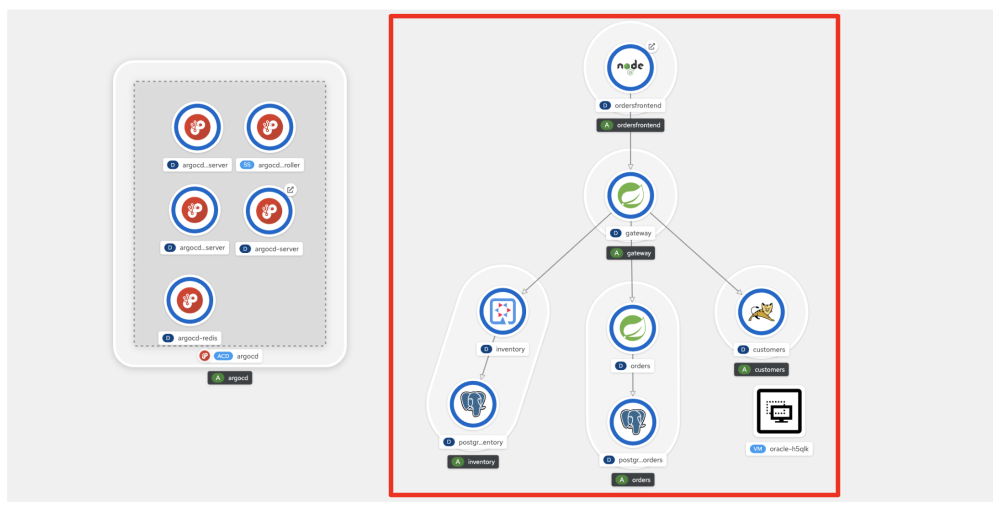

Now we need to update the `gateway` application's configuration to connect to the `customers` based on Kubernetes service name rather than the *IP address*.

== 6.3. Sync the Gateway application in ArgoCD

=== 6.3.1 Why OpenShift GitOps?

`GitOps` in short is a set of practices to use *Git pull requests* to manage infrastructure and application configurations. Git repository in GitOps is considered the only source of truth and contains the entire state of the system so that the trail of changes to the system state are visible and auditable.

Traceability of changes in GitOps is no novelty in itself as this approach is almost universally employed for the application source code. However GitOps advocates applying the same principles (`reviews`, `pull requests`, `tagging`, etc) to infrastructure and application configuration so that teams can benefit from the same assurance as they do for the application source code.

Although there is no precise definition or agreed upon set of rules, the following principles are an approximation of what constitutes a GitOps practice:

* Declarative description of the system is stored in Git (configs, monitoring, etc)
*Changes to the state are made via pull requests
*Git push reconciled with the state of the running system with the state in the Git repository

=== 6.3.2 Update the Gateway Configuration

Go back to the VS Code server and open the `application.yaml` file in *gatway/helm/config* directory. Replace *customers' URL* with the following URL.

[NOTE]
====
You must update the _application.yaml_ file in the `gateway` project rather than any other projects that you're working previously.
====

[source,yaml]
----
http://customers:8080/customers-tomcat-0.0.1-SNAPSHOT/customers
----

image::../images/update-customers-url.png[update-customers-url]

Switch to the `Source Control` menu in VSCode. Click on `+` button to add the changes (_application.yaml_).

Type `Update customers url` in the comment. Then, commit it(e.g. _Command + Enter on macOS_) and click on `Sync Changes`.

image::../images/update-customers-url-push.png[update-customers-url-push]

Access the ArgoCD admin console by clicking on `Open URL` over the *argocd-server* pod.

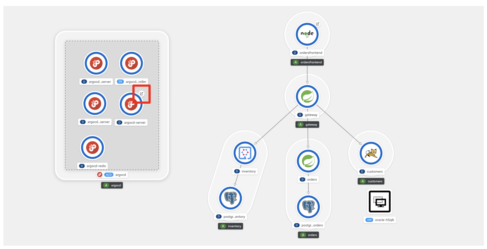

Then you will see the ArgoCD login page.

=== 6.3.3 Sync the configuration change by ArgoCD

Click on `LOG VIA OPENSHIFT` button.

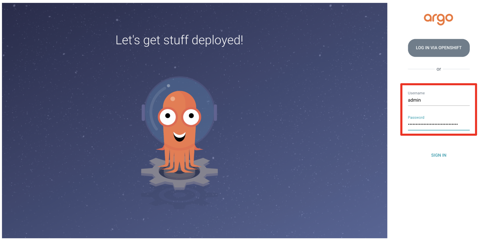

Then, enter your OpenShift login credentials.

* Username: `userXX`
* Password: `openshift`

you will see all applications such as _frontend, gateway, inventory, orders, and customers_. Click on `gateway` application.

image::../images/argocd-gateway.png[argocd-gateway]

When the code change (e.g. _application.yaml_) completes in _Gitea_ server, ArgoCD starts syncing the gateway application. It usually takes less than a minute to complete the sync. You can also click on `REFRESH` manually to sync the change instantly.

image::../images/argocd-sync.png[argocd-sync]

=== 6.3.4 Delete the Gateway Pod

Go to the OpenShift admin console to confirm if the `gateway-config` is updated based on the code change.

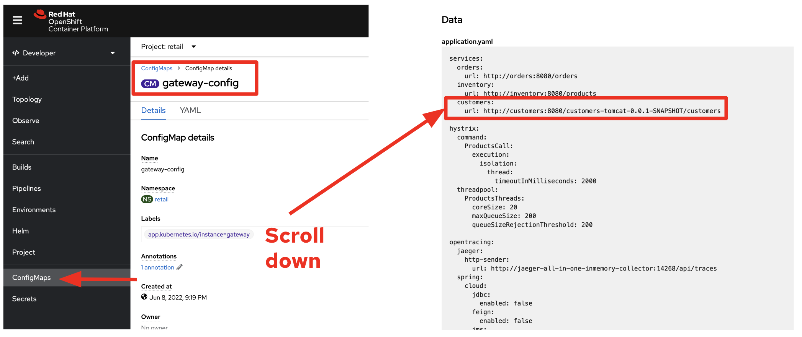

Now you need to kill the `gateway` pod to apply for the new ConfigMap. Go to the *Pod detail view*, click on `Delete Pod` in _Actions_ dropdown menu.

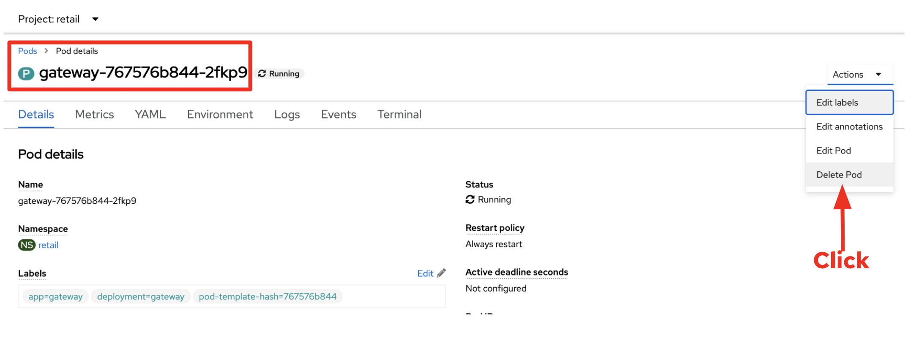

Click on 'Delete' on the popup window.

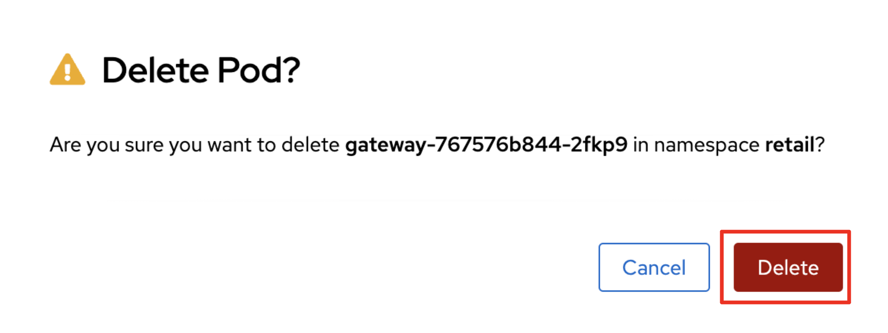

== 6.4. Revisit the GLOBEX web page

Let's go back to the `Customers` in the *GLOBEX* web page. You can find the frontend URL by running the following `oc` command in terminal on the _VS Code server_.

[source,sh]
----
oc get route ordersfrontend
----

The output should look like:

[source,texinfo]
----
NAME             HOST/PORT                                                                PATH   SERVICES         PORT   TERMINATION     WILDCARD
ordersfrontend   ordersfrontend-retail-user1.apps.cluster-mkddz.sandbox1883.opentlc.com          ordersfrontend   web    edge/Redirect   None
----

Open a new web browser to paste the above URL. Then, you can see the same customers data as you had in the VM.

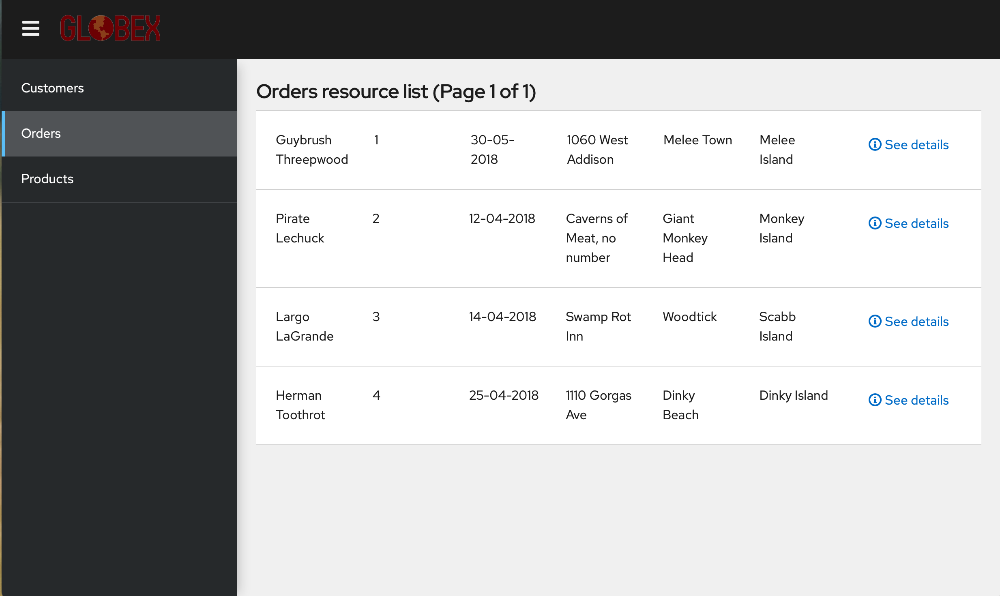

[NOTE]
====
You might see `Unknown` result for customers data since the customers application can't access the database on OpenShift Virtualization with an error - `java.sql.SQLSyntaxErrorException: ORA-00942: table or view does not exist`. In that case, restart the customer pod via deleting the pod in OpenShift admin console.
====

➡️ link:./7-enhance-apps.adoc[7. Enhance Applications with Managed Services]

⬅️ link:./5-rehost.adoc[5. Rehost]
