= Enhance Applications with Managed Services

:sectnums:
:sectlinks:
:doctype: book

== Introduction
In *Phase 2* of the App Mod journey, the customer would like to enhance their modernized application to include new requirements to tracking visitors activity and introduce API management to secure and manage their APIs.

=== Workshop scenario
.[underline]#*Click to read more about the story behind this lab*#
[%collapsible]
====

[discrete]
=== The Background

*In Phase 1:*

* The application is modernized into microservices and runs on OpenShift and  inherits all its benefits.
* Adoption of GitOps practices decreases Lead Time for Change, Mean Time to Recover and Change Failure Rate while increasing Deployment Frequency

Fast forward 6 months!

Taking advantage of this new momentum, the business comes up with new requirements for the e-commerce retail application.
In *Phase 2*, the customer would like to enhance their modernized application to include new requirements and features.

* Track how visitors engage with their website, derive intelligence  out of user activity stream
* Process and analyse  this user activity stream  to showcase Featured Products based on products with the most customer interest leading a more personalised experience.
* Introduce a multi-channel approach to build a mobile app as a new channel of access - mobile development is  most likely to be outsourced

[discrete]
=== Common Challenges

There are however a number of challenges with the new requirements:

* Adding new channels remains difficult, with a high risk of tight coupling to the existing services, which would slow down development productivity and time to market.
* The existing services need to be managed and secured to allow access for external partners and development teams. Governance remains a challenge.
* Adoption of new technologies such as event streaming requires time and new skills, which are not readily available inside the company.

In order to cope with these challenges, the development team decides for a new approach.

[discrete]
=== A new development approach

*Adoption of Apache Kafka* as a streaming platform to ingest and process user activity event streams.

*API First approach*:  API contract is formalized in a OpenAPI spec document before dev commences.  API design phase is done collaboratively with all stakeholders. The  first version of the OpenAPI spec document is pushed and managed in a service registry, which acts a the system of truth. Mocks are created for the API.

*Parallel Development* streams with  API first approach enables parallel development streams. 
- UI development teams and other API consumers start their development against the mocked 
- Backend development teams can implement the APIs using modern cloud-native frameworks and test the implementation against the OpenAPI spec to ensure that the implementation does not break the contract.

*Manage and Secure the APIs*  Use nn API management platform  to expose the APIs in a secure and managed manner for access by the mobile app and other 3rd party applications.

*Managed cloud services* preferred for easy and rapid adoption of new middleware components like the API Management platform and Apache Kafka; this allows the teams to focus on the business requirements, without the need to invest in skills and infrastructure to deploy and maintain these components.

====

=== Workshop goals

The primary goal of the workshop is to guide the user through 

* Adding *Event Streaming capabilities* to an application to allow tracking user activity
* Adding *API management capabilities* to an application to manage and secure the APIs for access by external teams

To learn how to demonstrate the API first approach and enabling parallel development, refer to https://redhat-solution-patterns.github.io/solution-pattern-enhancing-applications/solution-pattern-enhancing-applications/main/index.html[Solution Pattern: Enhancing Applications with Application Services,role=external,window=_blank] 

== Prerequisites: Setup the Cloud Services

=== Provision and configure a Streams for Apache Kafka instance

In this step you provision a Streams for Apache Kafka instance which will be used for the activity tracking events.

The instructions use the Red Hat Hybrid Cloud Console at link:https://console.redhat.com[console.redhat.com,role=external,window=_blank]. Instructions for the `rhoas` CLI can be found in the <<rhoas-cli-appendix,appendix>>.

. Navigate to https://console.redhat.com[console.redhat.com,role=external,window=_blank] and log in with your Red Hat account credentials.

. On the https://console.redhat.com[console.redhat.com] landing page, select *Application and Data Services* from the menu on the left.

. On the Application Services landing page, select *Streams for Apache Kafka → Kafka Instances*.
+
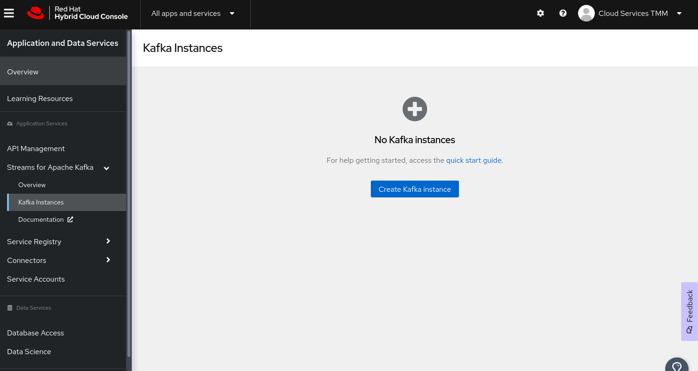

. On the *Kafka Instances* overview page, click the *Create Kafka* instance button. Enter `globex` as the name of the instance and select the relevant _Cloud region_ for your Kafka instance and click *Create instance*. This starts the provisioning process for your Kafka instance.
+
[NOTE]
====
This will create a evaluation Kafka instance, which will remain available for 48 hrs. The Kafka instance comes with some limitations, which are listed in the *Create instance* window. The eval Kafka instance consists of a single broker, while production Kafka brokers have a minimum of 3 brokers. 
====

. The new Kafka instance is listed in the instances table. After a couple of minutes, your instance should be marked as ready. 
+
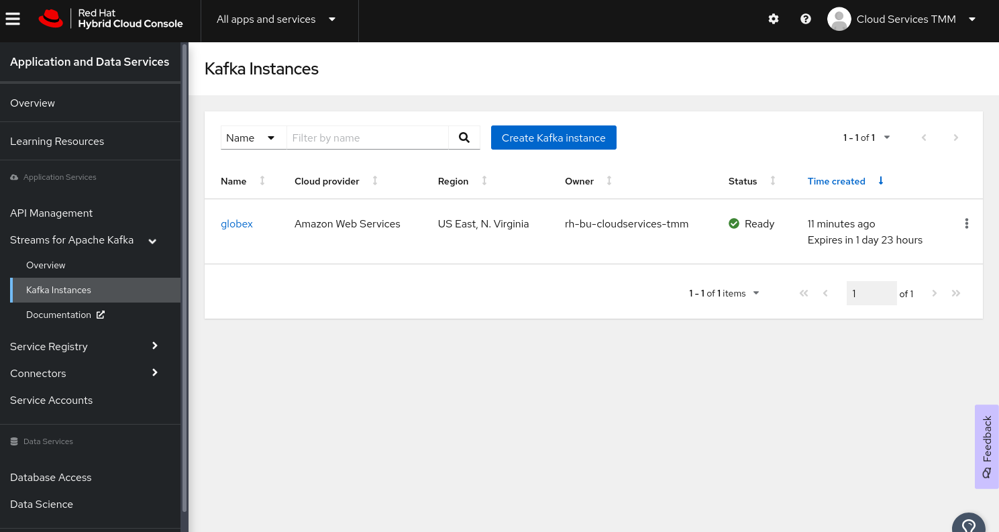

. When the instance _Status_ is _Ready_, you can start using the Kafka instance. You can use the options icon (three vertical dots) to view, connect to, or delete the instance as needed.

Normally, when using Streams for Apache Kafka, the next steps would be to create a service account and set up the Access Control List for that service account. However, when using Service Binding to connect applications to the Kafka instance, a service account is created as part of the binding. Once the service account is created, you will need to setup the required permissions for that service account. An alternative is to set up wildcard permissions (valid for all service accounts), but this is generally considered less secure.  

=== Setup Developer sandbox for Red Hat OpenShift API Management (RHOAM) sandbo

Register for a RHOAM sandbox by clicking on the red button in the https://red.ht/rhoam-sandbox[user activities page,role=external,window=_blank]

You will asked to confirm the registration through an email sent to your inbox. Once you launch the sandbox, follow these steps to setup a RHOAM sandbox tenant

* From the *Projects* dropdown on the top of the page, set the project namespace as *<username>-dev* from the projects that have been already created for you.
* Click on *Search* from the left navigation
* Click on *Resources* to search for `APIManagementTenant` and select it. 
+
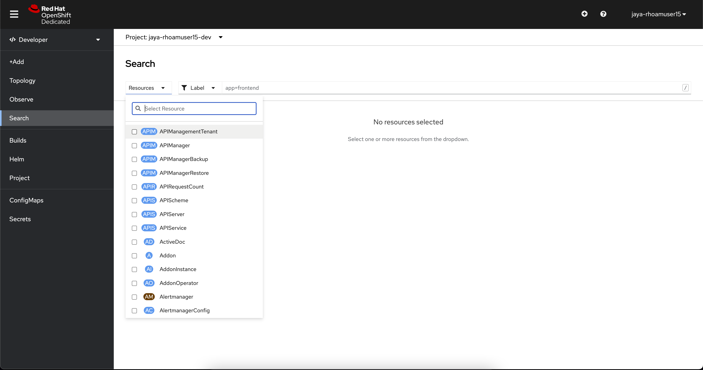
* Select *Create APIManagementTenant* button
+
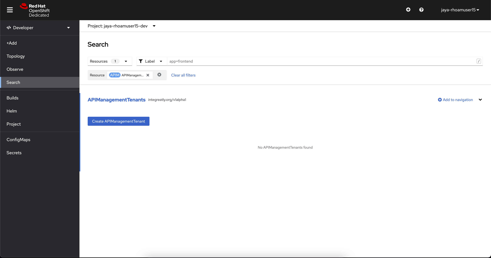
* You will be taken to the YAML configuration of this resource. Click the  Create button at the bottom of the YAML displayed.
* You will be taken to the Details page of this resource. Click on the YAML tab to view the changes to the YAML configuration.
* Watch for changes to the YAML of the APIManagementTenant resource, and wait for  the status to be displayed at the bottom of the YAML to become `status.provisioningStatus: 3scale account ready`
+
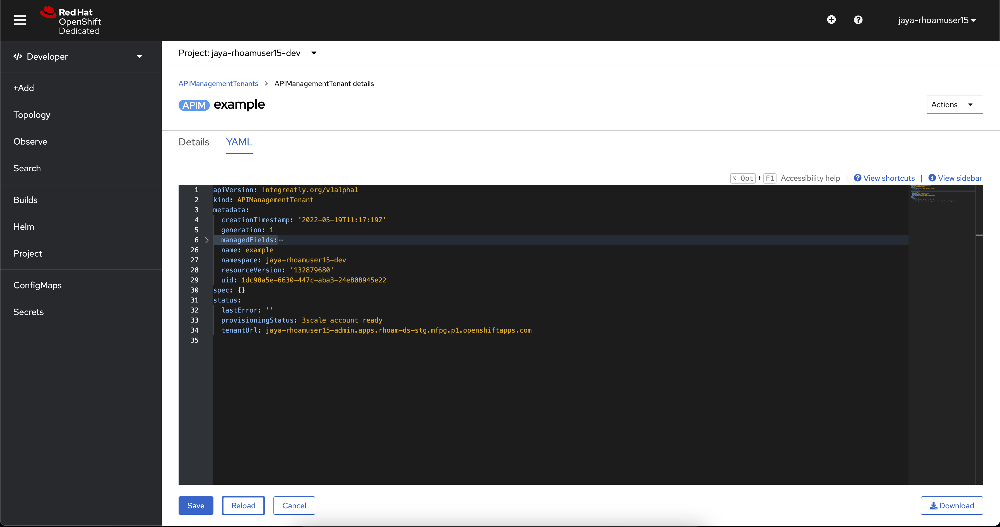
* The API Management  Tenant account is now provisioned and is ready for use. 
This may take a couple of minutes 
* To access OpenShift API Management, navigate to the Launcher pane on the right side, select `API Management`
+
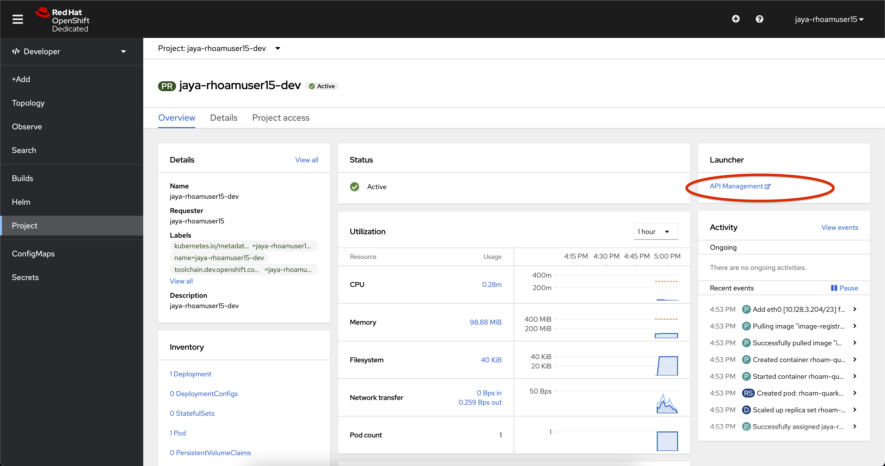
* Choose to *Authenticate through <> Red Hat Single Sign-On*, and  login using the identity provider that applies to you, e.g DevSandbox.
+
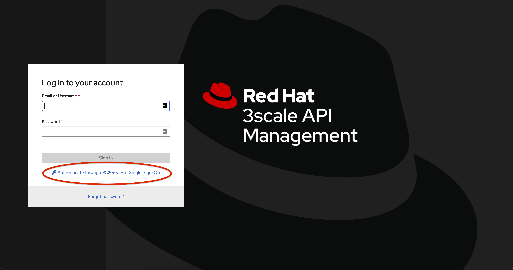 
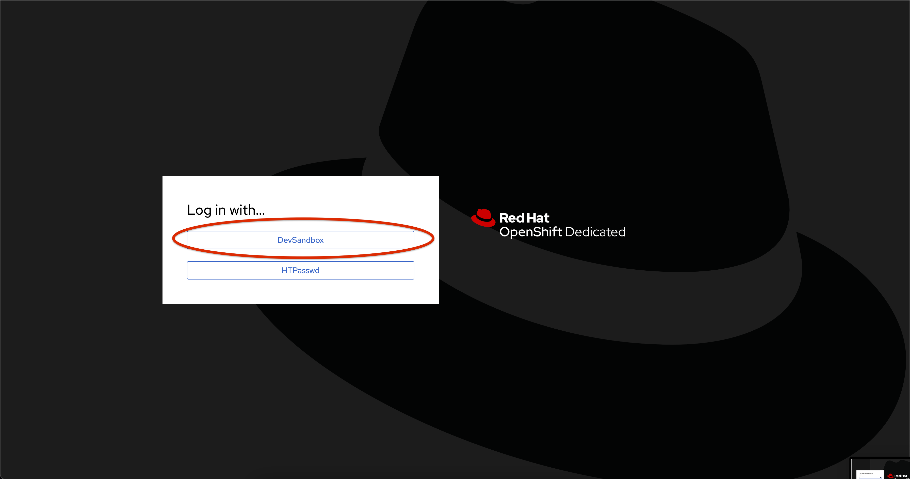 
* You will be able to view the Dashboard

This completes the environment prerequistes setup. In the next section, you will use these Cloud Services to enhance your applications.

== Adding Event Streaming capabilities to an application

=== Introduction

To support the business requirement of capturing and processing user activity on the Globex Coolstuff application, two new services have been developed:

* *Activity Tracking service*: This service exposes a REST endpoint. User activities on the Coolstuff website (such as opening a product page, liking a product etc..) generates an activity payload which is sent to the Activity tracking REST endpoint. The service transforms this payload into a Kafka message which is sent to a topic on the Kafka broker.
* *Recommendation Engine*: This service consumes and processes the events produced by the Activity Tracking service. The service uses the Kafka Streams library to continuously determine the top featured products (the products which generate the most activities).
The service also exposes a REST endpoint to expose the list of featured products.

Both services are developed using Quarkus and the Quarkus extensions for reactive messaging and Kafka Streams. The development of the services is outside the scope of this workshop, but you are encouraged to examine the source code of the applications on GitHub: link:https://https://github.com/app-modernization-workshop-globex/activity-tracking-service[Activity Tracking Service,role=external,window=_blank] and link:https://github.com/app-modernization-workshop-globex/recommendation-engine[Recommendation Engine,role=external,window=_blank]

=== Workshop Activities

In this part of the workshop you will connect the Activity Tracking and Recommendation Engine applications to the OpenShift Streams for Apache Kafka instance using link:https://docs.openshift.com/container-platform/4.10/applications/connecting_applications_to_services/understanding-service-binding-operator.html[Service Binding,role=external,window=_blank].

The setup and the configuration of the Streams for Apache Kafka instance as well as the service binding can also be done using the Red Hat OpenShift Application Services (`rhoas`) CLI. Instructions for completing the workshop using the `rhoas` CLI can be found in the <<rhoas-cli-appendix,appendix>> at the end of the instructions.

.[underline]#Click to learn more about Service Binding#
[%collapsible]
====
Service Binding allows you to communicate connection details and secrets to an application to allow it to bind to a service. In this context, a service can be anything: a Kafka instance, a NoSQL database, etc. By using Service Binding, we no longer need to configure connection details (host, port), authentication mechanisms (SASL, OAuth) and credentials (username/password, client id/client secret) in an application. Instead, Service Binding injects these variables into your application container (as files or environment variables) for your application to consume. The Quarkus Kubernetes Service Binding extension enables Quarkus applications to automatically pickup these variables, injected as files, from the container's filesystem, removing the need to specify any configuration settings in the application resources (e.g configuration files) themselves.

https://servicebinding.io/[Service Binding For Kubernetes,role=external,window=_blank]. 
====

=== Step-By-Step Instructions

==== Explore the environment

. In a browser window, navigate to the console of your OpenShift cluster. Open the *Developer* perspective in the *globex* namespace.
. In the Developer perspective, open the *Topology* view. Expect to see something like this (rearrange the topology as you see fit):
+
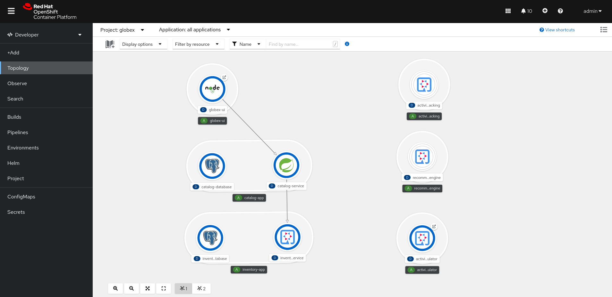
+
The deployed topology consists of:
+
** `globex-ui`: The Globex Coolstuff web application (Node.js/Angular). 
** `catalog-app`: The Globex Coolstuff catalog service, consisting of the catalog database and the Spring Boot catalog microservice.
** `inventory-app`: The Globex Coolstuff inventory service, consisting of the inventory database and the Quarkus inventory microservice.
** `activity-tracking`: The Activity Tracking service. Notice that the deployment of the service is scaled to zero. The service will be scaled up once the connection to the Kafka broker is set up.
**  `recommendation-engine`: The Recommendation Engine service. Notice that the deployment of the service is scaled to zero. The service will be scaled up once the connection to the Kafka broker is set up.
** `activity-tracking-simulator`: A Quarkus service that simulates user activity events and sends them to the Activity Tracking service.
. Find the route to the *Globex UI* application and open the URL in your browser. Expect to see the home page of the Globex Coolstuff web application:
+
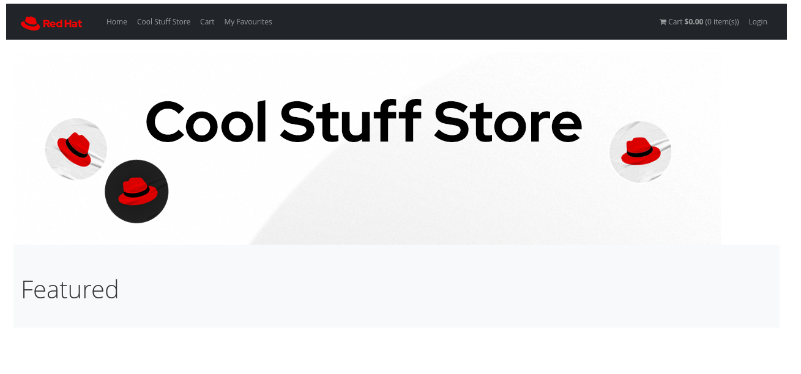
+
. Click on *Cool Stuff Store* in the top menu to see a paginated list of products:
+
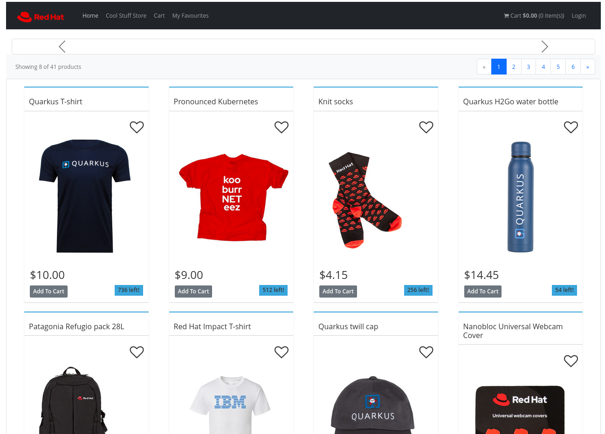
. The _Featured_ pane on the home page is empty at the moment. Also the product list page has an empty bar above the product list. These elements will be populated once the recommendation engine is up and running. 

==== Create a Kafka Topic in OpenShift Streams for Apache Kafka

. In the *Kafka Instances* page of the web console, click the name of the Kafka instance (`globex`) that you want to add a topic to.

. Select the *Topics* tab, click *Create topic*, and follow the guided steps to define the topic details. Click *Next* to complete each step and click *Finish* to complete the setup.
+
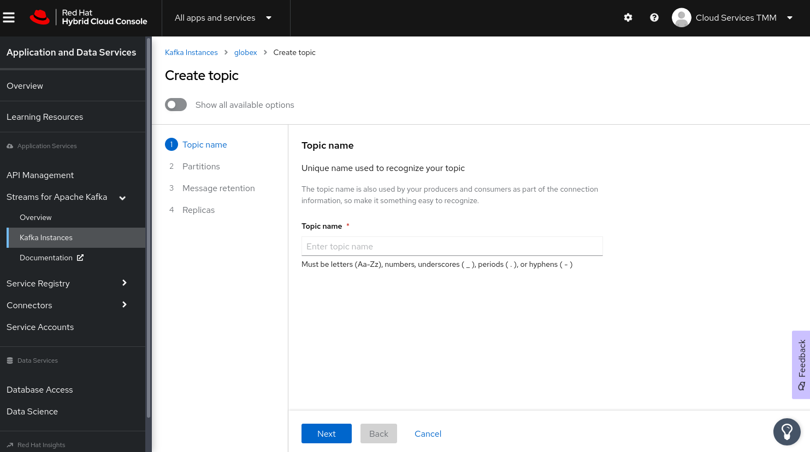
+
* *Topic name*: Enter `globex.tracking`.
* *Partitions*: Keep the default value at `1`. 
* *Message retention*: Keep default values. [ *Retention time*: `A week` and *Retention Size*: `Unlimited`. ]
* *Replicas*: Keep default values
+
[NOTE]
====
The Activity Tracking service, which has been already deployed for you, sends activity events to this topic named `globex.tracking`. Additional topics are required by the recommendation engine, but these topics are created dynamically when the application starts up.
====
+
.[underline]#*Click to learn more about these parameters*#
[%collapsible]
====
* Partitions are distinct lists of messages within a topic and enable parts of a topic to be distributed over multiple brokers in the cluster. A topic can contain one or more partitions, enabling producer and consumer loads to be scaled.
* Message retention time is the amount of time that messages are retained in a topic before they are deleted or compacted, depending on the cleanup policy. Retention size is the maximum total size of all log segments in a partition before they are deleted or compacted. For this workshop you can keep the default values.
* Replicas are copies of partitions in a topic. Partition replicas are distributed over multiple brokers in the cluster to ensure topic availability if a broker fails. When a follower replica is in sync with a partition leader, the follower replica can become the new partition leader if needed.
***For this release of Streams for Apache Kafka, the replicas are preconfigured. As the eval Kafka instance consists of only one broker, the number of partition replicas for the topic is set to `1`, as well as the minimum number of follower replicas that must be in sync with a partition leader. For a production Kafka broker on Streams for Apache Kafka these values will be `3` and `2` respectively. 
====
. After you complete the topic setup, the new Kafka topic is listed in the topics table. You can now start producing and consuming messages to and from this topic using services that you connect to this instance.
+
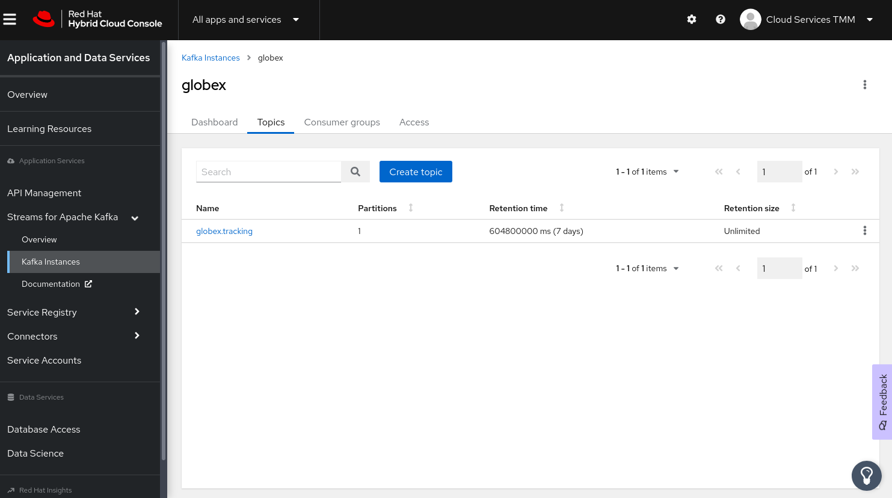

==== Binding applications to Streams for Apache Kafka

Binding applications to services using Service Binding requires the Service Binding operator to be installed on the OpenShift cluster. To bind more specifically to a OpenShift Streams for Apache Kafka instance, the Red Hat OpenShift Application Services (RHOAS) operator is required. Both operators have been installed on your OpenShift cluster.

===== [underline]#*Connect OpenShift Streams for Apache Kafka*#

In this part of the workshop you connect your OpenShift instance to the Streams for Kafka instance you created previously. This can be done from the Developer perspective on the OpenShift console, or using the `rhoas` CLI. Instructions for the CLI can be found in the <<rhoas-cli-appendix,appendix>>.

. In a browser window, navigate to the console of your OpenShift cluster. Open the *Developer* perspective in the *globex* namespace.
. In the Developer perspective, navigate to the *+Add* view. Locate the *Developer Catalog* card with the *Managed Services* entry
+
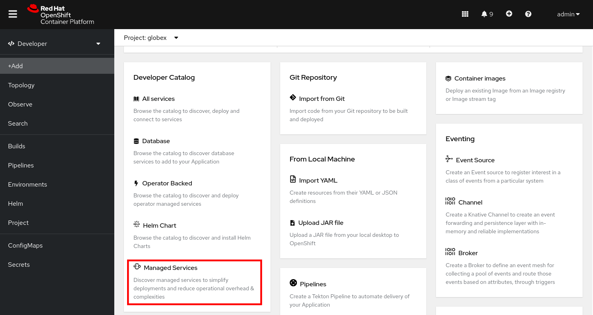
. Click the *Managed Services* link. This opens the Managed Services page, which has a card for *Red Hat OpenShift Application Services*.
+
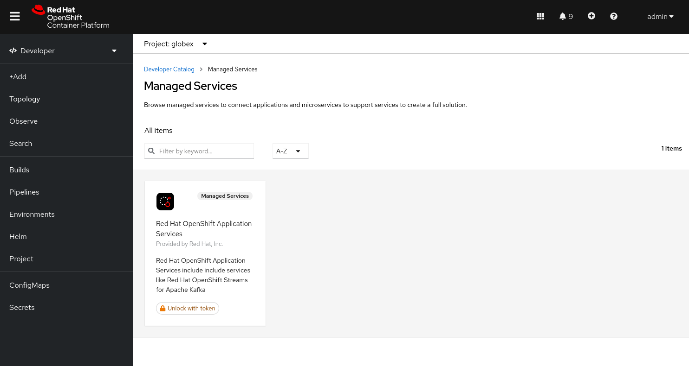
. In order to discover the managed services you are entitled to, you need to unlock the functionality with a token obtained from link:https://console.redhat.com[console.redhat.com]. Please make sure you are logged in with the RHN ID you had used to create the Kafka instance +
Open a new browser tab and navigate to link:https://console.redhat.com/openshift/token[console.redhat.com/openshift/token,role=external,window=_blank]. Click on *Load token* in the *Connect with offline token* box. Copy the generated API token.
. Go back to the browser tab with the OpenShift console, and click the *Red Hat OpenShift Application Services* card. Paste the API token value in the *API Token* field. Click *Connect*. +
This may take a minute or so. You are redirected back to the *Managed Services* page, which shows now a card for *Red Hat OpenShift Streams for Apache Kafka*.
+
image::../images/8-enhance-apps/openshift-console-rhosak.png[]
. Click the *Red Hat OpenShift Streams for Apache Kafka* card, and click *Connect*. This opens a page which shows the Kafka instances that you can connect to. Select the entry `globex` and click *Next*
+
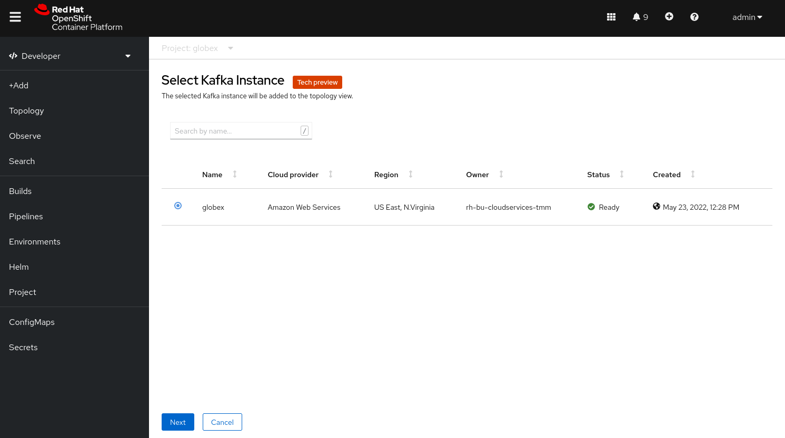
. You are redirected to the *Topology View* of the Developer perspective, which shows now an entry for the managed Kafka instance.
+
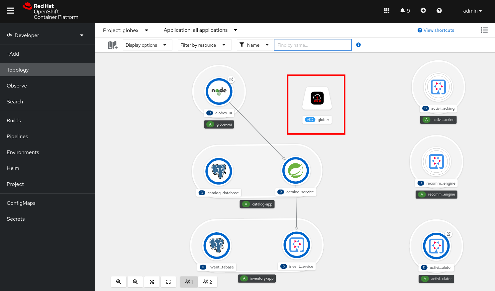
. The entry is backed by a `KafkaConnection` custom resource created by the OpenShift Application Services operator. To see the details of the KafkaConnection resource, click on the resource in the Topology view, and in the Details window, select *Edit KafkaConnection* to see the YAML structure of the custom resource. +
Notice that the YAML structure contains the bootstrap URL to the Kafka broker, as well as a reference to a secret containing the data of a service account, named `rh-cloud-services-service-account`.

===== [underline]#*Set Permissions for a Service Account*#

As part of connecting to the managed Kafka instance, a service account is created. This is the service account that will be used by the Activity Tracking and Recommendation Engine services to actually connect to the managed Kafka instance. To make this work, the service account needs permissions, in particular the service account needs to be able to consume from topics, produce to topics and create new topics.

Setting permissions in the Access Control List of a Streams for Apache Kafka can be done in the link:https://console.redhat.com[console.redhat.com] console, or using the `rhoas` CLI. Instructions for the CLI can be found in the <<rhoas-cli-appendix,appendix>>.

. Navigate to the *Application and Data Services* page of the link:https://console.redhat.com[console.redhat.com] console.
. On the *Service Accounts* page, check that a service account was created by the OpenShift Application Services operator. Look for a service account with a name like `rhoas-operator-xxx`.
. Navigate to the *Streams for Apache Kafka -> Kafka instances* page and open the page for your Kafka instance.
. Click the *Access* tab to view the current ACL for this instance.
+
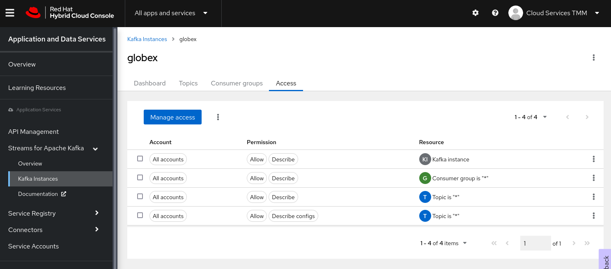

. Click *Manage access*, use the *Account* drop-down menu to select the service account that was created by the OpenShift Application Services operator, and click *Next*.

. Under *Assign Permissions*, use the drop-down menus to set the permissions shown in the following table for this service account. +
Select the *Consume from a topic* and *Produce to a topic* from the *Task-based permission* possibilities. Set the topic and consumer group names to `is` and `*`.
+
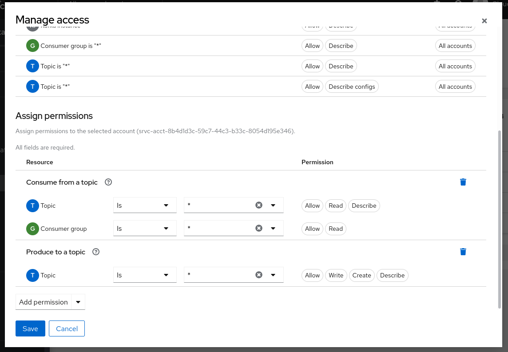
+
Click *Save*.
+
The ACL list for the service account should look like:
+
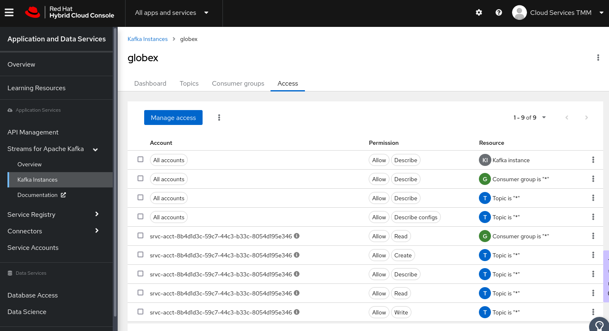

*Bind applications to Streams for Apache Kafka*

You can now bind the Activity Tracking Service and Recommendation Engine to the OpenShift Streams for Apache instance. Through Service Binding the connection details are injected into the application pods. Service Binding to a managed Kafka instance can be done on the Topology view of OpenShift console, or through the `rhoas` CLI. The instructions for the `rhoas` CLI can be found in the <<rhoas-cli-appendix,appendix>>.

. Navigate to the *Topology* view of the OpenShift console in the *globex* namespace.
. Hover over the *activity-tracking* deployment, and grab the arrow that appears. Drag the arrow to the *KafkaConnection* icon. When reaching the KafkaConnection icon, a text box `Create Service Binding` appears. Release the arrow. Click *Create* in the *Create Service Binding* pop-up window. The Activity Tracking deployment and the KafkaConnection icon are now connected with a solid black arrow.
+
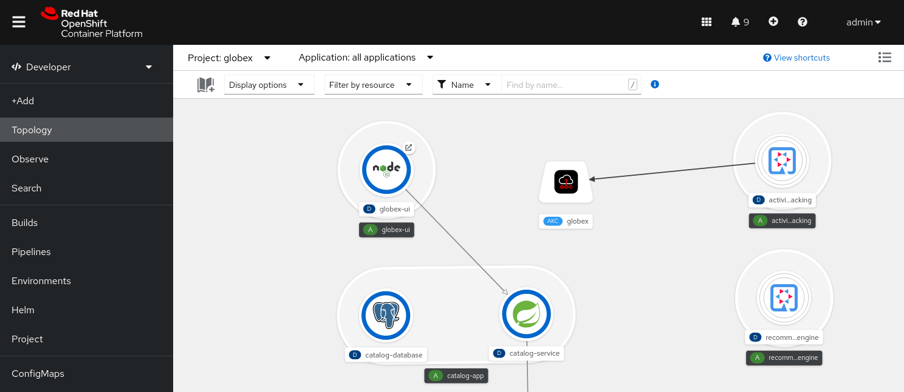
. Click on the activity-tracking deployment to open the details window, and click on the deployment name to open the full details of the Deployment. Notice that the service binding occurs by injecting a secret into the pod:
+
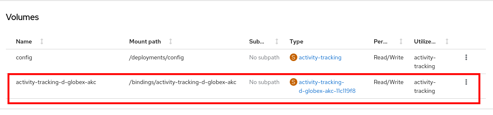
. Scale the activity-tracking deployment to 1 replica.
. Check the logs of the activity-tracking pod, and notice that the pod successfully connects to the Kafka broker instance.
+
----
exec java -Dquarkus.http.host=0.0.0.0 -Djava.util.logging.manager=org.jboss.logmanager.LogManager -XX:+ExitOnOutOfMemoryError -cp . -jar /deployments/quarkus-run.jar
__  ____  __  _____   ___  __ ____  ______ 
 --/ __ \/ / / / _ | / _ \/ //_/ / / / __/ 
 -/ /_/ / /_/ / __ |/ , _/ ,< / /_/ /\ \   
--\___\_\____/_/ |_/_/|_/_/|_|\____/___/   
2022-05-23 15:26:40,829 INFO  [org.apa.kaf.com.sec.aut.AbstractLogin] (main) Successfully logged in.
2022-05-23 15:26:41,061 INFO  [io.sma.rea.mes.kafka] (main) SRMSG18258: Kafka producer kafka-producer-tracking-event, connected to Kafka brokers 'globex-ca-m-q-mtp---qgalcrg.bf2.kafka.rhcloud.com:443', is configured to write records to 'globex.tracking'
2022-05-23 15:26:41,363 INFO  [io.quarkus] (main) activity-tracking-service 1.0.0-SNAPSHOT on JVM (powered by Quarkus 2.7.4.Final) started in 2.427s. Listening on: http://0.0.0.0:8080
2022-05-23 15:26:41,364 INFO  [io.quarkus] (main) Profile prod activated. 
2022-05-23 15:26:41,364 INFO  [io.quarkus] (main) Installed features: [cdi, kafka-client, resteasy-reactive, smallrye-context-propagation, smallrye-health, smallrye-reactive-messaging, smallrye-reactive-messaging-kafka, vertx]
----
. Repeat the same procedure for the *recommendation-engine* deployment. Once the service binding created, scale the deployment to 1 pod.
. Once the recommendation-engine is up and running, check in the link:https://console.redhat.com[console.redhat.com] console that a number of new topics have been created:
+
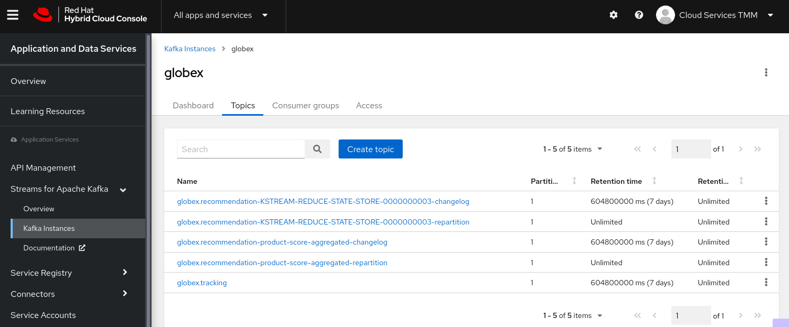
+
Those are the topics created by the Kafka Streams topology in the Recommendation Engine to calculate the top featured products based on activity events.

==== Testing the Globex Coolstuff application

Now that the Activity Tracking and Recommendation Engine apps are up and running, we can test the generation of activity events and the calculation of the top featured products.

The deployment topology for the workshop includes an activity simulator service which will generate a number of activity events randomly distributed over a list of products. These activity events are sent to the Activity Tracking service and transformed into Kafka messages in the `globex.tracking` topic. These messages are consumed by the Recommendation Engine app to calculate the top featured products.

. In the OpenShift console, locate the route for the *activity-tracking-simulator* deployment.
. Open a browser tab pointing to the application, and navigate to the `q/swagger-ui` path in the browser (e.g. `https://activity-tracking-simulator-globex.apps.cluster-tbjtw.sandbox1456.opentlc.com/q/swagger-ui`). This opens a Swagger UI page which allows you to use the REST API of the application. The REST application has only one operation, `POST /simulate`.
+
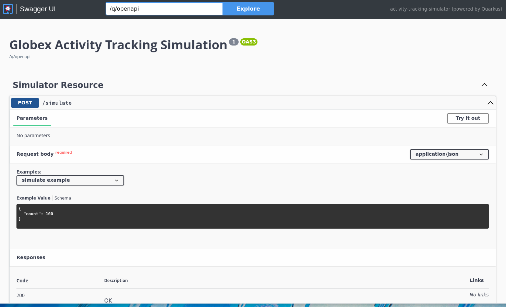
. Generate a number activities. Set `count` to any value between 100 and 1000.
. OpenShift Streams for Apache Kafka has a message viewer functionality that allows you to inspect the contents of messages in a topic. +
Navigate to link:https://console.redhat.com[console.redhat.com], select your Kafka instance and in the instance window select the *Topics* tab. Click on the `globex.tracking` topic, and select the messages tab. Notice the activity event messages, with a JSON payload:
+
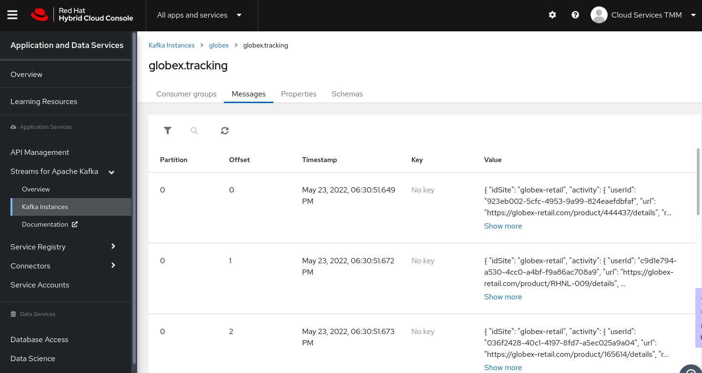
. The featured product list calculated by the Recommendation Engine is produced to the `globex.recommendation-product-score-aggregated-changelog` topic. The list is recalculated roughly every 10 seconds as long as activity events are produced. Every calculation produces a message to the changelog topic. The last message in the topic represents the latest top featured list.
+

. In a browser window, navigate to the home page of the Globex Coolstuff web application. Notice that the home page now shows a list of featured products.
+
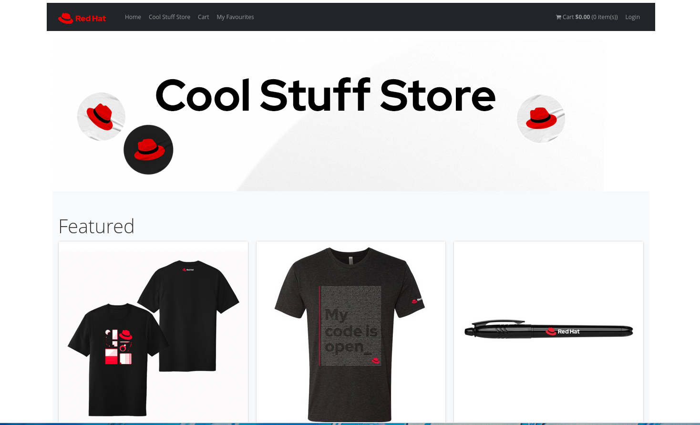
+
Also, the product page now shows a banner with the featured products.
+
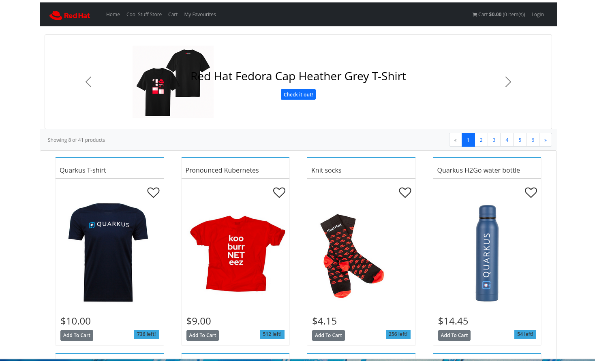

Congratulations! You reached the end of this part of the workshop, in which you added event streaming capabilities to the Globex Coolstuff application, using the OpenShift Streams for Apache Kafka managed cloud service, and Service Binding to connect your apps the the Kafka instance. 

:sectnums:

== Adding API Management capabilities to the application

In this part of the workshop you will use the  RHOAM sandbox environment that you have already setup in the prerequisites section to manage and secure the pre-deployed *Catalog* service.

=== Create an API Product

A product is a customer-facing API that packages one or more backends. You will create an API  Product manually with the following instructions

. In a browser window navigate to the Red Hat OpenShift API Management
. In the Dashboard, under the APIs section, click *Create Product* in the *_Products_* card.
+
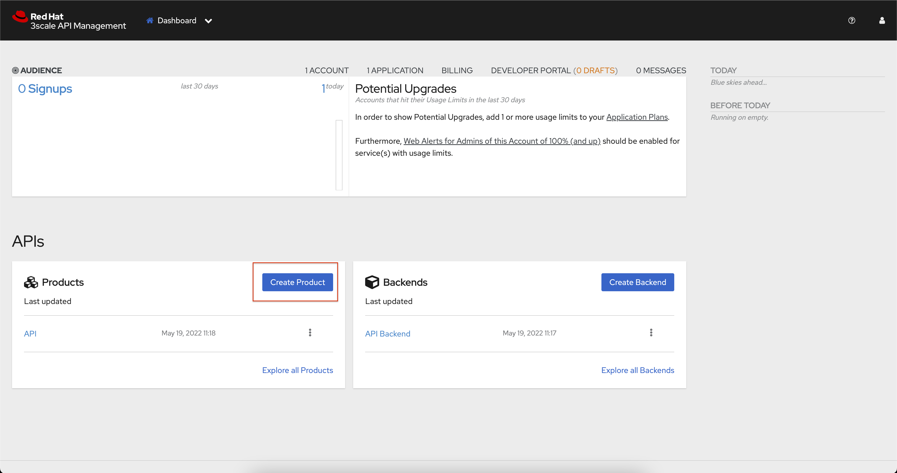
. Provide the following details:
+
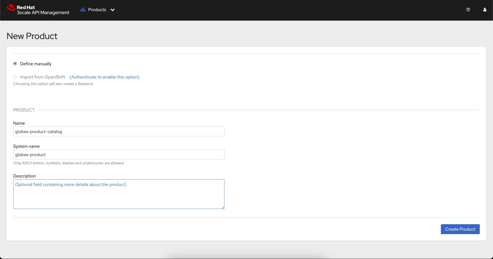
+
* *Name*: `globex-product-catalog`
* *System name*: `globex-product`
* *Description*: `Optional field containing more details about the product.`

. Click *Create Product*.
. A Product `globex-product-catalog` is created and you are taken to the Product Overview page

=== Create an API Backend
. In  the Dashboard, . Under the APIs section, click Create Backend in the *_Backends_* card
. Provide the following details and Click *Create Backend*
+
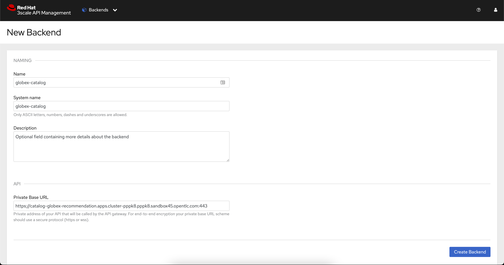
* *Name*: `globex-catalog`.
* *System name*: `globex-catalog`.
* *Description*: `Optional field containing more details about the backend`.
* *Private endpoint*: Base URL of the Product Catalog API.
+ 
[NOTE]
====
Here are instruction how to access the Private Endpoint of the Product Catalog API.

* Access the Developer Perspective Topology of the OpenShift enviroment where the Globex application has been deployed
* Click on the *catalog-service icon* and you will see the deployment details popup on the right hand side
+
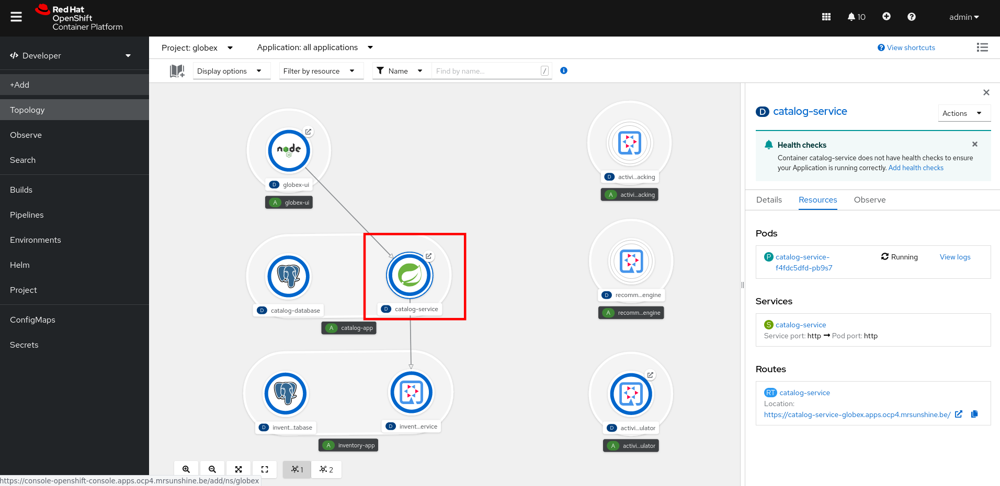
* Copy the Location as present at the bottom of this under Routes. This would look something like this `https://catalog-globex-recommendation.apps.cluster-pppk8.pppk8.sandbox45.opentlc.com:443`
====

=== Add  Backend to Product
. Navigate to the Product `*globex-product-catalog*` overview page, and navigare to  *Integration > Backend*
. Click on *Add Backend*, choose `globex-catalog` from the dropdown, and click on *Add to Product* button
+
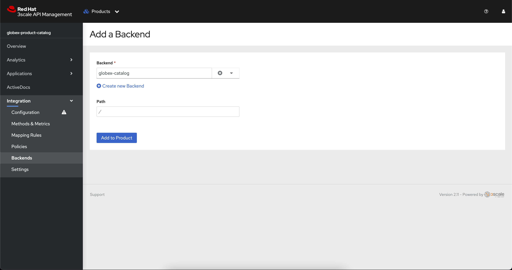

=== Create an application plans to define a customer-facing API product

. Go to the Dashboard
. Under the API section, click on  `globex-product-catalog` under the *_Product_*
. In Applications > Application Plans menu on the left hand side, click on *Create Application Plan*
. Provide the following details:
+
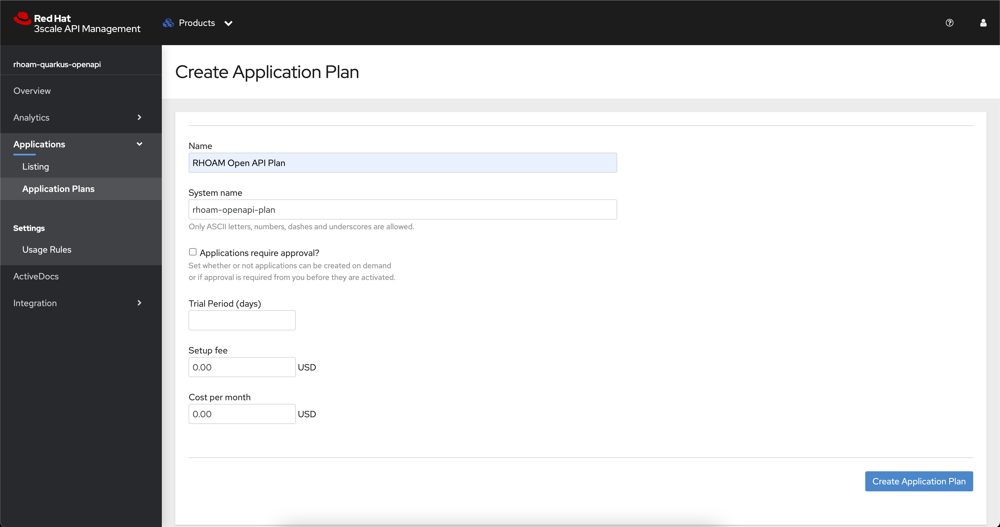
* *Name*: `globex-app-plan`
* *System name*: `globex-app-plan`
. Click *Create Application Plan*.

=== Create applications for the default account

An application is always associated with an application plan. Applications are stored within developer accounts. In basic 3scale plans only a single application is allowed. In enterprise plans, multiple applications per account are allowed.

. Navigate to Audience > Accounts > Listing.
. Click *Create* to create a new Developer account.
. Provide the following details:
+
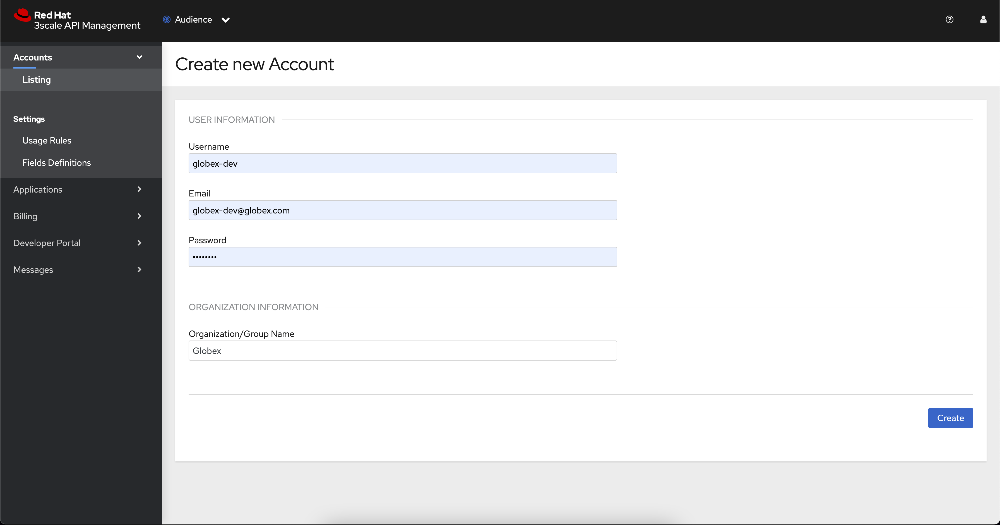
* *Username*: `globex-dev`
* *Email*: enter an email address
* *Password*: enter a password
* *Organization/Group Name*: `Globex`
. Click *Create*
. Go to the *Application tab* of this account through the navigation on the top of the page.
+
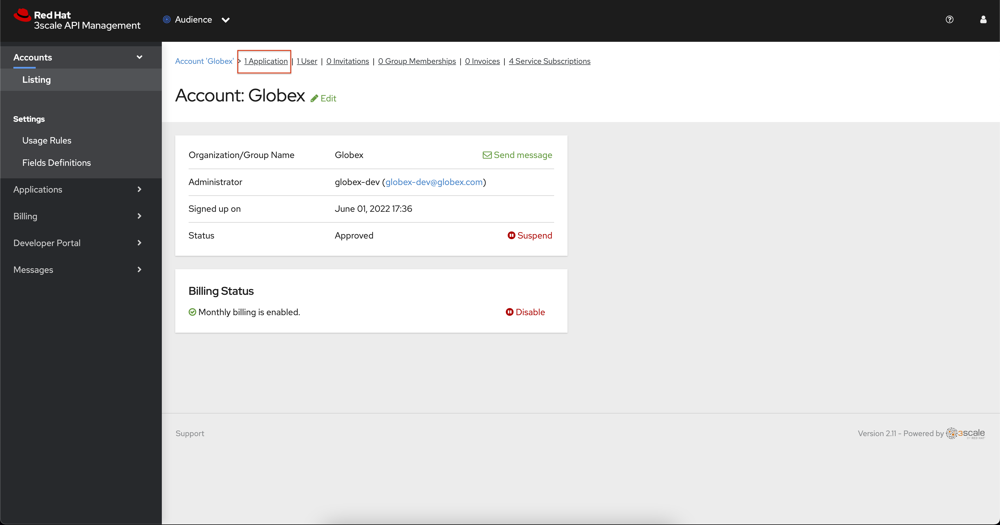
. Click *Create Application*.
. You will view the *New Application* page
. Choose the following details:
+
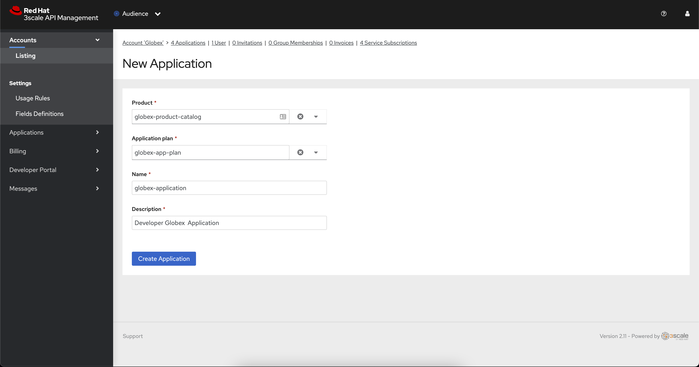
* *Product*: `globex-catalog`
* *Application plan*: `globex-app-plan`
* *Name*: `globex-application`
* *Description*: a suitable description
. Click *Create Application*.
. You can see your new application in Dashboard > Audience > Accounts > Applications > Listing

=== Test integration of the API

. Navigate to the Product > *globex-catalog* > Integration > Configuration
. Under *APIcast Configuration*, click `*Promote to Staging APIcast*` to promote the new APIcast configuration to staging,
. To test requests to your API product, copy the command provided in *Example curl for testing* and access it from a browser.
+
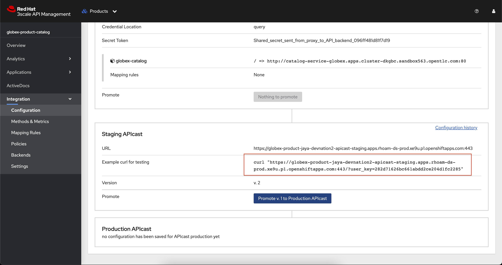
. Include the path `services/products` in the URL so that it looks something like this
`https://globex-product-jaya-devnation2-apicast-staging.apps.rhoam-ds-prod.xe9u.p1.openshiftapps.com/services/products?user_key=282d71626bc661abdd2ce204d1fc2285`
. After you run the command, you should get a JSON response containing results from Catalog API.
* In real life, the mobile app would be using the staging and production API endpoints securely to access the APIs.
* Click on the Analytics -> Traffic link on the left hand side. You will see the Hits details
+
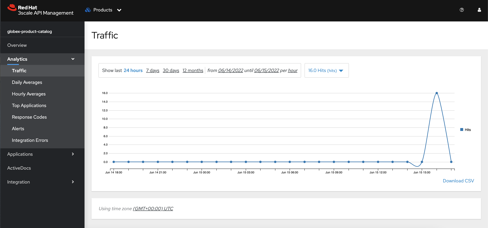

➡️ Next section: link:./8-summary.adoc[8 - Summary]

'''

[#rhoas-cli-appendix]
== Appendix: Use the `rhoas` CLI

If you prefer to use the `rhoas` CLI to provision and configure the OpenShift Streams for Apache Kafka instance, and to bind your applications to the Kafka instance using Service Binding, you can follow the following instructions:

* Install the `rhoas` CLI
** Obtain the latest release of the `rhoas` CLI archive for your operating system from the https://github.com/redhat-developer/app-services-cli/releases/latest[Red Hat OpenShift Application Services CLI releases] page on GitHub.
** Install the package (or extract the archive), and add the `rhoas` executable to your path.
** Check the version of the CLI
+
[.console-input]
[source,bash]
----
$ rhoas version
----
+
[.console-output]
[source,text]
----
rhoas version 0.42.2
----

* Login into Red Hat Application Services
+
[.console-input]
[source,bash]
----
$ rhoas login
----
+
This initiates a browser based login. Log in using your Red Hat Account credentials.

* Provision an evaluation Kafka instance:
** Provision the instance:
+
[.console-input]
[source,bash]
----
$ rhoas kafka create --name globex --region us-east-1
----
+
[.console-output]
[source,text]
----
{                                                                                                                  
  "cloud_provider": "aws",                                                                                         
  "created_at": "2022-05-23T17:20:03.700415552Z",                                                                  
  "href": "/api/kafkas_mgmt/v1/kafkas/ca5s4gjtq6jlcbnumh5g",                                                       
  "id": "ca5s4gjtq6jlcbnumh5g",                                                                                    
  "instance_type": "developer",                                                                                    
  "kafka_storage_size": "10Gi",                                                                                    
  "kind": "Kafka",                                                                                                 
  "multi_az": false,                                                                                               
  "name": "globex",                                                                                                
  "owner": "rh-bu-cloudservices-tmm",                                                                              
  "reauthentication_enabled": true,                                                                                
  "region": "us-east-1",                                                                                           
  "status": "accepted",                                                                                            
  "updated_at": "2022-05-23T17:20:03.700415552Z"                                                                   
}
----
** To check the status of the kafka instance:
+
[.console-input]
[source,bash]
----
$ rhoas status
----
+
[.console-output]
[source,text]
----
Service Context Name:   default
Context File Location:  /home/bernard/.config/rhoas/contexts.json

  Kafka
  -----------------------------------------------------------------------------
  ID:                     ca5s4gjtq6jlcbnumh5g
  Name:                   globex
  Status:                 ready
  Bootstrap URL:          globex-ca-s-gjtq-jlcbnumh-g.bf2.kafka.rhcloud.com:443
----

* Create a Kafka topic:
** Create the topic:
+
[.console-input]
[source,bash]
----
$ rhoas kafka topic create --name globex.tracking --partitions 1
----
** Verify the topics:
+
[.console-input]
[source,bash]
----
$ rhoas kafka topic list
----
+
[.console-output]
[source,text]
----
  NAME              PARTITIONS   RETENTION TIME (MS)   RETENTION SIZE (BYTES)  
 ----------------- ------------ --------------------- ------------------------ 
  globex.tracking            1   604800000             -1 (Unlimited)         
----

* Connect Streams for Apache Kafka instance.
** Before starting, make sure that you are connected to your OpenShift cluster using the `oc` CLI. 
** To connect your Kafka instance to your project, execute the following command in the terminal:
+
[.console-input]
[source,bash]
----
$ rhoas cluster connect -n globex
----
** You are asked to select the type of service you want to connect. Select *kafka* and press `enter`.
+
[.console-output]
[source,text]
----
? Select type of service  [Use arrows to move, type to filter]
> kafka
  service-registry
----
** The CLI will prints the *Connection Details* and asks you to confirm. Type `y` and press `enter` to continue.
+
[.console-output]
[source,text]
----
? Select type of service kafka
This command will link your cluster with Cloud Services by creating custom resources and secrets.
In case of problems please execute "rhoas cluster status" to check if your cluster is properly configured

Connection Details:

Service Type:                   kafka
Service Name:                   globex
Kubernetes Namespace:           globex
Service Account Secret:         rh-cloud-services-service-account

? Do you want to continue? (y/N) 
----
** You will be asked to provide a token, which can be retrieved from link:https://console.redhat.com/openshift/token[console.redhat.com/openshift/token]. Navigate to this URL, copy the token to your clipboard, and copy it into your terminal. Press `enter` to continue. 
+
You should see output similar to this:
+
[.console-output]
[source,text]
----
✔️  Token Secret "rh-cloud-services-accesstoken" created successfully
✔️  Service Account Secret "rh-cloud-services-service-account" created successfully

Client ID:     srvc-acct-553dd8d3-e461-411d-a76c-7769bbb5c45d

Make a copy of the client ID to store in a safe place. Credentials won't appear again after closing the terminal.

You will need to assign permissions to service account in order to use it.

You need to separately grant service account access to Kafka by issuing following command

  $ rhoas kafka acl grant-access --producer --consumer --service-account srvc-acct-553dd8d3-e461-411d-a76c-7769bbb5c45d --topic all --group all

✔️  kafka resource "globex" has been created
Waiting for status from kafka resource.
Created kafka can be already injected to your application.

To bind you need to have Service Binding Operator installed:
https://github.com/redhat-developer/service-binding-operator

You can bind kafka to your application by executing "rhoas cluster bind"
or directly in the OpenShift Console topology view.

✔️  Connection to service successful.
----
+
[NOTE]
====
The same command can also be run in a non-interactive way:

[.console-input]
[source,bash]
----
$ rhoas cluster connect -n globex --service-type kafka --service-name globex --token eyJhbGciOiJ...GDC-cTHCwgmxT-nzM -y
----
====

** To verify that the connection has been successfully created, execute the following oc command: 
+
[.console-input]
[source,bash]
----
$ oc get KafkaConnection -n globex 
----
+
This should return a *KafkaConnection* with the name of your Kafka instance.
+
[.console-output]
[source,text]
----
NAME        AGE
globex      3m42s
----

* Assign permissions to the service account created by the OpenShift Application Services operator:
+
[.console-input]
[source,bash]
----
$ rhoas kafka acl grant-access --producer --consumer --service-account srvc-acct-553dd8d3-e461-411d-a76c-7769bbb5c45d --topic all --group all -y
----
+
[.console-output]
[source,text]
----
The following ACL rules will be created:

  PRINCIPAL (7)                                    PERMISSION   OPERATION   DESCRIPTION              
 ------------------------------------------------ ------------ ----------- ------------------------- 
  srvc-acct-553dd8d3-e461-411d-a76c-7769bbb5c45d   allow        describe    topic is "*"             
  srvc-acct-553dd8d3-e461-411d-a76c-7769bbb5c45d   allow        read        topic is "*"             
  srvc-acct-553dd8d3-e461-411d-a76c-7769bbb5c45d   allow        read        group is "*"             
  srvc-acct-553dd8d3-e461-411d-a76c-7769bbb5c45d   allow        write       topic is "*"             
  srvc-acct-553dd8d3-e461-411d-a76c-7769bbb5c45d   allow        create      topic is "*"             
  srvc-acct-553dd8d3-e461-411d-a76c-7769bbb5c45d   allow        write       transactional-id is "*"  
  srvc-acct-553dd8d3-e461-411d-a76c-7769bbb5c45d   allow        describe    transactional-id is "*"  

✔️  ACLs successfully created in the Kafka instance "globex"
----

* Bind an application to a Streams for Apache Kafka instance.
** Execute the following command:
+
[.console-input]
[source,bash]
----
$ rhoas cluster bind -n globex
----
** You are asked to select the application you want to connect to. Select *activity-tracking* and press `enter`. (When repeating for the second application, select *recommendation-engine*)
+
[.console-output]
[source,text]
----
Looking for Deployment resources. Use --deployment-config flag to look for deployment configs
? Please select application you want to connect with  [Use arrows to move, type to filter]
> activity-tracking
  activity-tracking-simulator
  catalog-database
  catalog-service
  globex-ui
  inventory-database
  inventory-service
  recommendation-engine
----
** You are asked to select the type of service you want to connect. Select *kafka* and press `enter`.
+
[.console-output]
[source,text]
----
Looking for Deployment resources. Use --deployment-config flag to look for deployment configs
? Please select application you want to connect with activity-tracking
? Select type of service  [Use arrows to move, type to filter]
> kafka
  service-registry
----
**  The CLI asks you to confirm. Type `y` and press `enter` to continue.
+
[.console-output]
[source,text]
----
Looking for Deployment resources. Use --deployment-config flag to look for deployment configs
? Please select application you want to connect with activity-tracking
? Select type of service kafka
Binding "globex" with "activity-tracking" app
? Do you want to continue? (y/N)
----
+
The CLI produces the following output:
+
[.console-output]
[source,text]
----
Using ServiceBinding Operator to perform binding
✔️  Binding globex with activity-tracking app succeeded
----
+
[NOTE]
====
The command can also be run in a non-interactive way:

[.console-input]
[source,bash]
----
$ rhoas cluster bind -n globex --app-name activity-tracking --service-type kafka --service-name globex -y
$ rhoas cluster bind -n globex --app-name recommendation-engine --service-type kafka --service-name globex -y
----
====