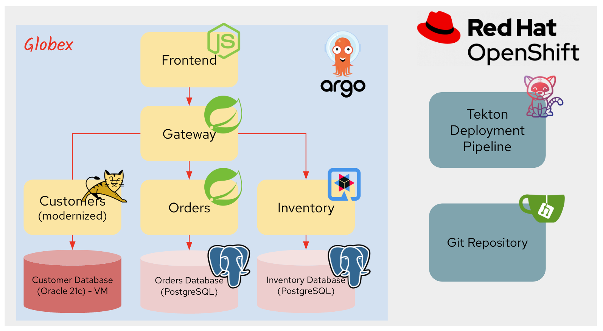

= Summary

You've learned today how to solve the business and technical challenges as below by modernizing existing applications along with the Red Hat application modernization strategies and tools.

* *Integration*: Challenging to leverage new cloud based services
* *Scalability*: Not able to meet web scale due to data-centric architecture
* *Reliability*: Unable to quickly deploy new capabilities
* *Developer Productivity* and *Business Agility*: Often low in comparison to cloud native applications

We believe that you had a chance to learn how the app migration strategies (e.g. _Rehost, Replatform, Refactor_) provide benefits and effort.

image::../images/app-mod-benefits.png[app-mod-benefits]

Finally, you ended up with the following modernized architecture to manage multiple microservices such as _frontend, gateway, customers, orders, and inventory_ on Red Hat OpenShift. The new technology stack enables the SRE team to automate the applications deployment along with DevOps and CI/CD practices. 

== Additional Resources

* https://www.redhat.com/en/topics/application-modernization[Understanding application modernization^]
* https://www.redhat.com/en/topics/devops/what-cicd-pipeline[Cloud-native CI/CD on OpenShift^]
* https://www.redhat.com/en/resources/java-app-modernization-with-openshift-e-book[eBook - Plan your Java application modernization journey^]
* https://kubebyexample.com/en/learning-paths/migrating-kubernetes/assess-and-refactor-tackle[Migrating Kubernetes Learning Path^]

